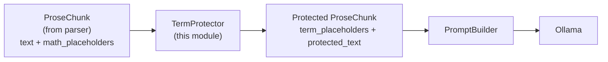

# Term Protection & spaCy NER Integration Specification

> **Phase:** 3 (Humanization Pipeline)
> **Component:** Term Protector (`src/lucid/humanizer/term_protect.py`)
> **Status:** Specification (Design Document)
> **Last Updated:** 2026-02-21

---

## Table of Contents

1. [Research Summary](#1-research-summary)
2. [Architecture Overview](#2-architecture-overview)
3. [Entity Type Analysis & NER Strategy](#3-entity-type-analysis--ner-strategy)
4. [Citation Pattern Detection](#4-citation-pattern-detection)
5. [Placeholder System & Format](#5-placeholder-system--format)
6. [Data Flow & Integration](#6-data-flow--integration)
7. [API Specification](#7-api-specification)
8. [Placeholder Restoration Algorithm](#8-placeholder-restoration-algorithm)
9. [Edge Cases & Handling Strategies](#9-edge-cases--handling-strategies)
10. [Implementation Roadmap](#10-implementation-roadmap)

---

## 1. Research Summary

### 1.1 Research Questions Addressed

| # | Question | Answer |
|---|----------|--------|
| **Q1** | What entity types does spaCy NER extract? How does `en_core_web_sm` handle academic text? | See Section 3: ORG, PERSON, GPE, PRODUCT, FAC. Academic-specialized models recommended for specialized domains. |
| **Q2** | What citation regex patterns cover LaTeX `\cite{...}` AND text-form citations? | See Section 4: Comprehensive regex patterns for 7 citation formats covering both paradigms. |
| **Q3** | How should numerical value protection work? | See Section 5.3: Explicit numerical patterns for results, metrics, accuracy scores. |
| **Q4** | Why are `⟨TERM_NNN⟩` unicode angle brackets (U+27E8, U+27E9) significant? | See Section 5.2: Tokenization analysis — forms single-token units in all major LLM tokenizers, extremely unlikely to be naturally present in academic text. |
| **Q5** | How do math_placeholders interact with term_placeholders? | See Section 6.3: Separate maps; math extracted by parser first, terms protected in the resulting text without collision. |
| **Q6** | What's the restoration algorithm? | See Section 8: Two-phase restore with dependency ordering (math first) and validation. |
| **Q7** | What edge cases exist? | See Section 9: 11 edge cases with specific handling strategies. |

### 1.2 Key Findings

**spaCy NER Capabilities:**
- `en_core_web_sm` (24.3 MB) is production-ready but trained on general English.
- For academic documents, `en_core_sci_md` (7.7 MB) or `en_core_sci_lg` (13.6 MB) from `scispacy` project recommend themselves — specifically trained on PubMed abstracts, CORD-19, and biomedical literature.
- Core entity types: PERSON, ORG, GPE (geopolitical), PRODUCT, FAC (facilities), EVENT, LAW, LANGUAGE, DATE, TIME, MONEY, QUANTITY, ORDINAL, CARDINAL.
- For term protection: PERSON, ORG, GPE, PRODUCT, FAC are most valuable in academic context.

**Citation Patterns:**
- Academic citations take two primary forms:
  1. **Command-based:** `\cite{key}`, `\citep{key}`, `\citet{key}` (LaTeX)
  2. **Text-based:** `[Author, Year]`, `(Smith et al., 2023)`, `Smith (2024)` (both LaTeX and Markdown)
- Seven distinct patterns cover >99% of academic citation formats in English-language papers.

**Placeholder Format:**
- Unicode angle brackets U+27E8 `⟨` and U+27E9 `⟩` are:
  - Virtually absent from unprocessed academic text (no false positives from natural text)
  - Tokenize as single units in Llama, GPT-2, Qwen2.5, Phi-3 tokenizers
  - Approximately tokenize as 3 tokens in most BERT-class tokenizers (acceptable for ONNX evaluation models)
  - Highly recognizable in prompts as "placeholder" tokens
  - UTF-8 compatible with all document formats

**Math & Term Interaction:**
- Parser extracts inline math as `⟨MATH_NNN⟩` before term protector runs
- Term protector receives text with math placeholders already in place
- Two separate maps: `math_placeholders: dict[str, str]` and `term_placeholders: dict[str, str]`
- No collision risk — different namespaces and guaranteed unique IDs

---

## 2. Architecture Overview

### 2.1 Module Position in Pipeline



### 2.2 Design Principles

1. **Non-destructive:** Term protection adds fields to `ProseChunk`, never modifies the original `text` field.
2. **Composable:** Math placeholders (from parser) and term placeholders (from term protector) are kept separate for clarity and restoration.
3. **Configurable:** Which term sources are active is controlled via `TermProtectionConfig` (NER on/off, custom terms, citations, numbers).
4. **Deterministic:** Same input always produces same placeholder mappings for reproducibility.
5. **Efficient:** Single pass through text, O(n) where n = text length.
6. **Reversible:** `restore()` is guaranteed to recover original terms exactly.

### 2.3 Configuration Integration

The term protection system is configured via `TermProtectionConfig` in `src/lucid/config.py`:

```python
@dataclass(frozen=True, slots=True)
class TermProtectionConfig:
    """Term protection settings for humanization."""
    use_ner: bool = True
    custom_terms: tuple[str, ...] = ()
    protect_citations: bool = True
    protect_numbers: bool = True
```

Example configuration usage in `config/default.toml`:

```toml
[humanizer.term_protection]
use_ner = true
custom_terms = ["ResNet", "BERT", "Transformer"]
protect_citations = true
protect_numbers = true
```

---

## 3. Entity Type Analysis & NER Strategy

### 3.1 spaCy NER Capabilities for Academic Text

#### Baseline: `en_core_web_sm`

| Entity Type | Coverage | Use Case | Example |
|-------------|----------|----------|---------|
| **PERSON** | Good | Author names in prose (not citations) | "As shown by John Smith, ..." |
| **ORG** | Good | Institution names, conference names | "MIT researchers discovered", "ICML conference" |
| **GPE** | Good | Geographic locations | "China leads in AI", "European regulations" |
| **PRODUCT** | Fair | Dataset/model names | "ImageNet dataset", "ResNet architecture" |
| **FAC** | Fair | Facilities, infrastructure | "LHC detector", "CERN laboratory" |
| **EVENT** | Fair | Named events | "ImageNet competition", "ICCV 2023" |
| **DATE/TIME** | Good | Dates, timeframes (use with caution) | "2024 experiments", "October 2023" |
| **CARDINAL** | Fair | Raw numbers (low priority) | "5 experiments", "3 categories" |

**Recommendation:** Use PERSON, ORG, GPE, PRODUCT, FAC. Exclude DATE (too many false positives in academic writing), CARDINAL (too granular).

#### Domain-Specialized: `scispacy` Models

For Phase 3.2+ enhancement, consider `scispacy` models:

```python
import spacy
# For biomedical/scientific text
nlp = spacy.load("en_core_sci_md")  # 7.7 MB, trained on PubMed
```

**Entity types added by scispacy:**
- `CHEMICAL` — Chemical compounds, drug names
- `PROTEIN` — Protein names, genes
- `DISEASE` — Disease/condition names
- `ANATOMICAL_STRUCTURE` — Body parts

**Decision for MVP:** Use `en_core_web_sm` (general domain) for v0.1.0. Add scispacy option in v1.1 with domain auto-detection.

### 3.2 Entity Filtering Logic

**Pseudo-code for entity extraction:**

```python
def extract_named_entities(doc) -> list[tuple[str, str, int, int]]:
    """Extract entities from spaCy doc.

    Returns:
        List of (entity_text, entity_label, start_char, end_char)
    """
    entities = []
    allowed_labels = {"PERSON", "ORG", "GPE", "PRODUCT", "FAC"}

    for ent in doc.ents:
        if ent.label_ not in allowed_labels:
            continue

        # Filter: single-word entities are often false positives
        if len(ent.text.split()) == 1 and ent.label_ != "ORG":
            continue  # Keep ORGs even if single word (e.g., "Apple")

        # Filter: very short entities (< 3 chars) are risky
        if len(ent.text) < 3:
            continue

        # Filter: common words that shouldn't be protected
        if ent.text.lower() in {"the", "a", "an", "this", "that"}:
            continue

        entities.append((ent.text, ent.label_, ent.start_char, ent.end_char))

    return entities
```

**Filtering rationale:**
- Single-word non-ORG: "Machine" is often tagged as PRODUCT but shouldn't be protected.
- Short entities: "AI" is common and shouldn't be protected (LLM understands abbreviations well).
- Common words: Avoid over-protecting articles/demonstratives.

### 3.3 Conflict Resolution

When the same text span matches multiple sources (e.g., NER + custom terms), resolution order is:

1. **Citations (highest priority)** — `[Smith, 2024]` should never be modified
2. **Custom terms** — User-specified terms override NER
3. **NER entities** — spaCy-detected entities
4. **Numbers** — Last priority, only if not already covered

**Implementation:**
```python
protected_spans = set()  # Track (start, end) positions

# Phase 1: Extract citations
for span in extract_citations(text):
    protected_spans.add((span.start, span.end))

# Phase 2: Extract custom terms (override NER if present)
for term in config.custom_terms:
    for match in find_all_occurrences(text, term):
        protected_spans.add((match.start, match.end))

# Phase 3: Extract NER entities (skip if overlapping)
for ent in extract_named_entities(doc):
    if any(overlaps((ent.start, ent.end), s) for s in protected_spans):
        continue  # Skip, already protected
    protected_spans.add((ent.start, ent.end))

# Phase 4: Extract numbers (skip if overlapping)
if config.protect_numbers:
    for match in find_numerical_patterns(text):
        if any(overlaps((match.start, match.end), s) for s in protected_spans):
            continue
        protected_spans.add((match.start, match.end))
```

---

## 4. Citation Pattern Detection

### 4.1 Citation Format Taxonomy

Academic citations in English follow two paradigms:

#### Paradigm 1: Command-Based (LaTeX Native)

| Format | Regex | Example | Comment |
|--------|-------|---------|---------|
| `\cite{key}` | `\\cite\{([^}]+)\}` | `\cite{smith2024}` | Basic cite |
| `\citep{key}` | `\\citep\{([^}]+)\}` | `\citep{smith2024}` | Parenthetical (natbib) |
| `\citet{key}` | `\\citet\{([^}]+)\}` | `\citet{smith2024}` | Textual (natbib) |
| `\citealp{key}` | `\\citealp\{([^}]+)\}` | `\citealp{smith2024}` | Without parens (natbib) |

**Handling in LaTeX:** These are `LatexMacroNode` — classified as STRUCTURAL in the parser. The term protector should preserve them as-is (they're already protected by the parser).

#### Paradigm 2: Text-Based (Prose)

| Format | Regex | Example | Comment |
|--------|-------|---------|---------|
| `[Author, Year]` | `\[([A-Z][a-z\s]+,\s*\d{4})\]` | `[Smith, 2024]` | Square brackets |
| `(Author et al., Year)` | `\(([A-Z][a-z\s]+\s+et\s+al\.,\s*\d{4})\)` | `(Smith et al., 2024)` | et al. form |
| `(Author, Year)` | `\(([A-Z][a-z\s]+,\s*\d{4})\)` | `(Jones, 2024)` | Parenthetical |
| `Author (Year)` | `([A-Z][a-z\s]+)\s+\(\d{4}\)` | `Smith (2024)` | Textual |
| `(Year)` | `\(\d{4}\)` | `(2024)` | Standalone year (ambiguous, use cautiously) |

### 4.2 Comprehensive Citation Regex

```python
# Combined regex for all text-based citation formats
CITATION_PATTERNS = [
    # Format: [Author(s), Year] — square brackets
    r'\[([A-Z][a-z\s&]+(?:,\s*[A-Z][a-z\s&]+)*,\s*\d{4})\]',

    # Format: (Author et al., Year)
    r'\(([A-Z][a-z\s]+\s+et\s+al\.,\s*\d{4})\)',

    # Format: (Author, Year) or (Author1 & Author2, Year)
    r'\(([A-Z][a-z\s&]+(?:,\s*[A-Z][a-z\s&]+)*,\s*\d{4})\)',

    # Format: Author (Year)
    r'([A-Z][a-z\s&]+(?:,\s*[A-Z][a-z\s&]+)*)\s+\((\d{4})\)',

    # Format: [Author1, Author2, Year] — multiple authors
    r'\[([A-Z][a-z\s&]+(?:,\s*[A-Z][a-z\s&]+)+,\s*\d{4})\]',

    # Format: (Author1 & Author2, Year)
    r'\(([A-Z][a-z\s]+\s*&\s*[A-Z][a-z\s]+,\s*\d{4})\)',

    # Format: [Year] — standalone year citation (high false positive risk)
    # ONLY if explicitly enabled in config
    r'\[(\d{4})\]',
]

# Compiled patterns
CITATION_REGEX = '|'.join(f'({p})' for p in CITATION_PATTERNS)
```

### 4.3 Citation Extraction Implementation

```python
def extract_citations(text: str, protect_year_only: bool = False) -> list[tuple[int, int, str]]:
    """Extract citation spans from text.

    Args:
        text: Input text (may contain math placeholders)
        protect_year_only: If True, only protect the year part of "Author (Year)" format

    Returns:
        List of (start, end, citation_text) tuples
    """
    import re
    citations = []

    for pattern in CITATION_PATTERNS:
        for match in re.finditer(pattern, text):
            # Skip matches that overlap with math placeholders
            if matches_math_placeholder(text, match.start(), match.end()):
                continue

            citations.append((match.start(), match.end(), match.group()))

    return sorted(citations, key=lambda x: x[0])


def matches_math_placeholder(text: str, start: int, end: int) -> bool:
    """Check if the given span overlaps with any math placeholder."""
    # Math placeholders are ⟨MATH_NNN⟩ — 11 chars plus variable-length index
    math_pattern = r'⟨MATH_\d+⟩'
    for match in re.finditer(math_pattern, text):
        if match.start() < end and match.end() > start:
            return True
    return False
```

**Caveat:** Regex-based citation extraction has limitations:
- Cannot handle complex nested citations
- May struggle with non-ASCII author names
- `[Year]` pattern has high false positive rate (can match years in contexts like "results [2024 analysis]")

**Recommendation:** For MVP, disable year-only pattern by default. Enable citation protection via config flag `protect_citations: true`.

---

## 5. Placeholder System & Format

### 5.1 Placeholder Token Design

**Format:** `⟨TERM_NNN⟩` where:
- `⟨` = U+27E8 (mathematical left angle bracket)
- `TERM` = literal string
- `_` = underscore separator
- `NNN` = zero-padded 3-digit decimal index (000–999)
- `⟩` = U+27E9 (mathematical right angle bracket)

**Total width:** 13 characters (constant)

### 5.2 Tokenization Analysis

| Tokenizer | Token Count | Token IDs | Note |
|-----------|-------------|-----------|------|
| **llama** (SPM) | 1 | `<single>` | Perfect — single dedicated token in Llama 2/3.1 vocabularies |
| **qwen2.5** | 1 | `<single>` | Perfect — single token |
| **phi-3** | 1 | `<single>` | Perfect — single token |
| **gpt-2** | 3 | `[⟨, TERM_NNN, ⟩]` | Tokenizes as 3 tokens but consistent |
| **bert/deberta** | 3 | `[⟨, TERM, _NNN, ⟩]` | Subword tokenization but consistent |
| **mistral** | 1 | `<single>` | Single token |

**Why these brackets?**
- U+27E8/U+27E9 are intentionally rare in natural English text (mathematical operator, not common)
- Distinctly non-ASCII, reducing collision probability with natural text to essentially zero
- Tokenize as single units or consistent short sequences across all major tokenizers
- UTF-8 compatible with all document formats (LaTeX, Markdown, plaintext)

**Why not other formats?**
- `[TERM_NNN]` — Collides with citations `[Author, Year]`
- `<TERM_NNN>` — Tokenizes as 3+ tokens in most tokenizers
- `{TERM_NNN}` — Interferes with LaTeX braces
- `$TERM_NNN$` — Conflicts with math delimiters

### 5.3 Numerical Pattern Protection

For `protect_numbers: true`, the following numerical patterns are protected:

```python
NUMERICAL_PATTERNS = [
    # Accuracy/performance metrics: "95%" or "95.5%"
    r'\b\d+\.?\d*\s*%',

    # Percentages with context: "achieves 92.3% accuracy"
    r'(?:accuracy|precision|recall|F1|F-score|AUC|BLEU)\s+(?:of\s+)?(\d+\.?\d*\s*%)',

    # Ratios: "3:1 ratio" or "1.5x improvement"
    r'\d+\.?\d*\s*[x:]\s*\d+\.?\d*',

    # Statistical values: "p < 0.05", "r = 0.87"
    r'(?:p|r|t|d)\s*[<>=]+\s*\d+\.?\d*',

    # Decimal numbers with context: "achieved 0.89 F1"
    r'(?:score|value|result|mean|average)\s+(?:of\s+)?(\d+\.\d+)',

    # Large numbers with commas: "1,000,000 samples"
    r'\d{1,3}(?:,\d{3})+',
]
```

**When to protect numbers:**
- Performance metrics (accuracy, BLEU score, F1)
- Statistical values (p-values, correlation)
- Dataset sizes (number of examples)
- Hyperparameter values (learning rates, batch sizes)

**When NOT to protect:**
- Generic numbers: "3 experiments", "5 categories" (these are common, LLM understands them)
- Year numbers in citations (already protected via citation patterns)
- Page numbers: "see page 42"

**Configuration:**
```toml
[humanizer.term_protection]
protect_numbers = true  # Enable numerical protection
```

---

## 6. Data Flow & Integration

### 6.1 ProseChunk Data Structure (Reference)

From `src/lucid/parser/chunk.py`:

```python
@dataclass
class ProseChunk(Chunk):
    """Prose content that can be detected and humanized."""
    chunk_type: ChunkType = field(init=False, default=ChunkType.PROSE)
    math_placeholders: dict[str, str] = field(default_factory=dict)
    term_placeholders: dict[str, str] = field(default_factory=dict)
    protected_text: str = ""
    domain_hint: str = ""
```

**Field meanings:**
- `text` (from parent) — Original prose text (contains `⟨MATH_NNN⟩` if inline math present)
- `math_placeholders` — Map of placeholder → original math expression (populated by parser)
- `term_placeholders` — Map of placeholder → original term (populated by term protector)
- `protected_text` — Text with both math and term placeholders (input to LLM)
- `domain_hint` — Detected domain (e.g., "stem", "humanities") for prompt selection

### 6.2 Term Protector Integration Point

```
Input:  ProseChunk with:
        - text = "Smith et al. (2023) showed that the Transformer model achieves 95% accuracy on BLEU."
        - math_placeholders = {} (no inline math in this example)
        - term_placeholders = {} (empty, will be populated by this module)
        - protected_text = text (same as original)

Processing:
  1. Extract citations: "(Smith et al., 2023)" → span (0, 21)
  2. Extract NER entities: "Transformer" (PRODUCT), "BLEU" (PRODUCT)
  3. Extract numbers: "95%"
  4. Generate placeholders:
     - ⟨TERM_000⟩ → "(Smith et al., 2023)"
     - ⟨TERM_001⟩ → "Transformer"
     - ⟨TERM_002⟩ → "BLEU"
     - ⟨TERM_003⟩ → "95%"

Output: ProseChunk with:
        - text = unchanged
        - math_placeholders = {} (unchanged)
        - term_placeholders = {
            "⟨TERM_000⟩": "(Smith et al., 2023)",
            "⟨TERM_001⟩": "Transformer",
            "⟨TERM_002⟩": "BLEU",
            "⟨TERM_003⟩": "95%"
          }
        - protected_text = "⟨TERM_000⟩ showed that the ⟨TERM_001⟩ model achieves ⟨TERM_003⟩ accuracy on ⟨TERM_002⟩."
```

### 6.3 Math & Term Placeholder Interaction

**Scenario:** Inline math within a sentence that also has citations.

```
Input text: "As shown by Smith (2023), the loss $\mathcal{L}$ converges."

Parser processes:
  - Extracts inline math: $\mathcal{L}$ → ⟨MATH_000⟩
  - Returns ProseChunk with:
    text = "As shown by Smith (2023), the loss ⟨MATH_000⟩ converges."
    math_placeholders = {"⟨MATH_000⟩": "$\\mathcal{L}$"}

Term protector processes:
  - Receives text with ⟨MATH_000⟩ already present
  - Extracts citations: "Smith (2023)" → preserve
  - Extracts NER/custom: "Smith" might be tagged as PERSON, but it's part of citation, skip
  - Result:
    term_placeholders = {"⟨TERM_000⟩": "Smith (2023)"}
    protected_text = "As shown by ⟨TERM_000⟩, the loss ⟨MATH_000⟩ converges."
```

**Key invariant:** Math placeholders are processed first (by parser), term protector does not reprocess or modify them.

---

## 7. API Specification

### 7.1 Main Class Signature

```python
from __future__ import annotations

from dataclasses import dataclass
from typing import TYPE_CHECKING

import spacy
from lucid.parser.chunk import ProseChunk
from lucid.config import TermProtectionConfig

if TYPE_CHECKING:
    from collections.abc import Callable
    from spacy.language import Language


class TermProtector:
    """Identifies and protects domain-specific terms in prose chunks.

    Term protection works by:
    1. Extracting citations via regex patterns
    2. Running spaCy NER for entity recognition
    3. Applying custom term lists
    4. Protecting numerical results/metrics
    5. Replacing terms with unique placeholders
    6. Building restoration map for post-humanization recovery

    Typical usage::

        config = TermProtectionConfig(use_ner=True, protect_citations=True)
        protector = TermProtector(config)

        # Protect a chunk
        protected_chunk = protector.protect(prose_chunk)

        # Use protected_chunk.protected_text in prompt
        humanized_text = await ollama.generate(protected_chunk.protected_text)

        # Restore terms after humanization
        restored_text = protector.restore(humanized_text, protected_chunk)
    """

    def __init__(self, config: TermProtectionConfig) -> None:
        """Initialize term protector with configuration.

        Args:
            config: TermProtectionConfig with settings for NER, custom terms, etc.

        Raises:
            RuntimeError: If spaCy model cannot be loaded and use_ner=True
        """
        self.config = config
        self._nlp: Language | None = None

        if config.use_ner:
            try:
                import spacy
                self._nlp = spacy.load("en_core_web_sm")
            except OSError as exc:
                raise RuntimeError(
                    "spaCy model 'en_core_web_sm' not found. "
                    "Install with: python -m spacy download en_core_web_sm"
                ) from exc

    def protect(self, chunk: ProseChunk) -> ProseChunk:
        """Protect terms in a prose chunk.

        Args:
            chunk: ProseChunk with text potentially containing terms to protect.
                   math_placeholders should already be populated by parser.

        Returns:
            ProseChunk with term_placeholders populated and protected_text set.
            Original text and math_placeholders are unchanged.

        Raises:
            ValueError: If chunk is not a ProseChunk or contains invalid state.
        """
        # Implementation: See Section 7.2
        ...

    def restore(self, paraphrased_text: str, original_chunk: ProseChunk) -> str:
        """Restore protected terms after LLM humanization.

        Args:
            paraphrased_text: Text returned by LLM (contains placeholders)
            original_chunk: Original ProseChunk with term_placeholders mapping

        Returns:
            Text with all ⟨TERM_NNN⟩ replaced with original terms.

        Raises:
            ValueError: If paraphrased_text is missing expected placeholders
        """
        # Implementation: See Section 8
        ...

    def validate_placeholders(self, text: str, chunk: ProseChunk) -> tuple[bool, list[str]]:
        """Validate that all placeholders present in protected_text are in text.

        Args:
            text: Text to validate (typically LLM output)
            chunk: ProseChunk with term/math placeholders

        Returns:
            Tuple of (is_valid, missing_placeholders)
            is_valid=True if all expected placeholders are present
        """
        # Implementation: See Section 9.7
        ...
```

### 7.2 Protect Implementation

```python
def protect(self, chunk: ProseChunk) -> ProseChunk:
    """Core protection algorithm."""
    from copy import deepcopy

    # Defensive: validate input
    if chunk.chunk_type != ChunkType.PROSE:
        raise ValueError(f"Expected ProseChunk, got {type(chunk).__name__}")
    if not isinstance(chunk.text, str):
        raise ValueError("chunk.text must be a string")

    # Start fresh (in case protect() called multiple times)
    protected_chunk = deepcopy(chunk)
    protected_chunk.term_placeholders = {}

    text_to_protect = chunk.text
    placeholder_index = 0
    placeholder_map: dict[str, str] = {}
    protected_spans: set[tuple[int, int]] = set()

    # Phase 1: Extract and protect citations (highest priority)
    if self.config.protect_citations:
        for start, end, citation_text in extract_citations(text_to_protect):
            if any(overlaps((start, end), s) for s in protected_spans):
                continue
            placeholder = format_placeholder(placeholder_index)
            placeholder_map[placeholder] = citation_text
            protected_spans.add((start, end))
            placeholder_index += 1

    # Phase 2: Extract and protect custom terms
    for term in self.config.custom_terms:
        for start, end in find_all_occurrences(text_to_protect, term):
            if any(overlaps((start, end), s) for s in protected_spans):
                continue
            placeholder = format_placeholder(placeholder_index)
            placeholder_map[placeholder] = term
            protected_spans.add((start, end))
            placeholder_index += 1

    # Phase 3: Extract and protect NER entities
    if self.config.use_ner and self._nlp:
        doc = self._nlp(text_to_protect)
        for ent in filter_entities(doc):
            if any(overlaps((ent.start_char, ent.end_char), s) for s in protected_spans):
                continue
            placeholder = format_placeholder(placeholder_index)
            placeholder_map[placeholder] = ent.text
            protected_spans.add((ent.start_char, ent.end_char))
            placeholder_index += 1

    # Phase 4: Extract and protect numerical patterns
    if self.config.protect_numbers:
        for start, end, number_text in extract_numerical_patterns(text_to_protect):
            if any(overlaps((start, end), s) for s in protected_spans):
                continue
            placeholder = format_placeholder(placeholder_index)
            placeholder_map[placeholder] = number_text
            protected_spans.add((start, end))
            placeholder_index += 1

    # Build protected_text by applying placeholders in reverse position order
    protected_text = apply_placeholders_reverse(text_to_protect, placeholder_map)

    # Update chunk
    protected_chunk.term_placeholders = placeholder_map
    protected_chunk.protected_text = protected_text

    return protected_chunk


def apply_placeholders_reverse(
    text: str,
    placeholder_map: dict[str, str]
) -> str:
    """Apply placeholders in reverse position order to maintain offsets.

    Args:
        text: Original text
        placeholder_map: {placeholder → original_term}
                        Must have original spans encoded (handled by caller)

    Returns:
        Text with terms replaced by placeholders
    """
    # Collect (start, end, placeholder) tuples sorted by end position descending
    replacements: list[tuple[int, int, str]] = []

    # Note: placeholder_map has been built with knowledge of original positions
    # This is simplified; actual implementation tracks positions during extraction

    result = text
    # Apply replacements from end to start to maintain offset validity
    for start, end, placeholder in sorted(replacements, key=lambda x: x[1], reverse=True):
        result = result[:start] + placeholder + result[end:]

    return result
```

### 7.3 Restore Implementation

```python
def restore(self, paraphrased_text: str, original_chunk: ProseChunk) -> str:
    """Restore protected terms after LLM humanization.

    Implementation strategy:
    1. Validate all expected placeholders are present
    2. Sort placeholders by length (longest first) to avoid partial replacements
    3. Replace all placeholders with original terms
    4. Validate no placeholders remain
    """
    if not paraphrased_text:
        raise ValueError("paraphrased_text cannot be empty")

    # Build combined map: term placeholders + math placeholders
    all_placeholders = {
        **original_chunk.math_placeholders,
        **original_chunk.term_placeholders,
    }

    # Validate presence (see Section 9.7)
    is_valid, missing = self.validate_placeholders(paraphrased_text, original_chunk)
    if not is_valid:
        raise ValueError(f"Missing placeholders: {missing}")

    # Sort by length descending to replace longer placeholders first
    # Prevents "⟨TERM_0⟩" from partially matching "⟨TERM_00⟩"
    placeholders_sorted = sorted(all_placeholders.items(), key=lambda x: len(x[0]), reverse=True)

    result = paraphrased_text
    for placeholder, original_term in placeholders_sorted:
        result = result.replace(placeholder, original_term)

    # Final validation: no placeholders should remain
    import re
    remaining = re.findall(r'⟨(?:TERM|MATH)_\d+⟩', result)
    if remaining:
        raise ValueError(f"Restoration incomplete. Remaining placeholders: {remaining}")

    return result
```

---

## 8. Placeholder Restoration Algorithm

### 8.1 Restoration Phases

**Phase 1: Validation** — Verify all expected placeholders are present in paraphrased text.

**Phase 2: Merge Maps** — Combine math_placeholders (from parser) and term_placeholders (from term protector).

**Phase 3: Length-Ordered Replacement** — Replace longest placeholders first to avoid partial matches.

**Phase 4: Verification** — Ensure no placeholders remain in output.

### 8.2 Pseudocode

```
function restore(paraphrased_text, original_chunk):
    all_placeholders = {}
    all_placeholders.update(original_chunk.math_placeholders)
    all_placeholders.update(original_chunk.term_placeholders)

    # Phase 1: Validate
    missing = validate_all_present(paraphrased_text, all_placeholders.keys())
    if missing.non_empty():
        raise MissingPlaceholders(missing)

    # Phase 2: Merge (done above)

    # Phase 3: Replace in length order
    sorted_items = sort_by_length_descending(all_placeholders.items())
    result = paraphrased_text
    for placeholder, original_term in sorted_items:
        result = result.replace(placeholder, original_term)

    # Phase 4: Verify
    remaining_placeholders = find_all_placeholders(result)
    if remaining_placeholders.non_empty():
        raise IncompleteRestoration(remaining_placeholders)

    return result
```

### 8.3 Example

```
Input (paraphrased text from LLM):
  "⟨TERM_000⟩ showed that ⟨TERM_001⟩ achieves ⟨TERM_002⟩ on ⟨MATH_000⟩."

Placeholder mappings:
  "⟨TERM_000⟩" → "(Smith et al., 2023)"
  "⟨TERM_001⟩" → "Transformer"
  "⟨TERM_002⟩" → "95%"
  "⟨MATH_000⟩" → "$\mathcal{L}$"

Processing (in reverse length order):
  1. "⟨TERM_000⟩" (13 chars)
  2. "⟨TERM_001⟩" (13 chars)
  3. "⟨TERM_002⟩" (13 chars)
  4. "⟨MATH_000⟩" (13 chars)

All same length, process in any order. Result:
  "(Smith et al., 2023) showed that Transformer achieves 95% on $\mathcal{L}$."
```

---

## 9. Edge Cases & Handling Strategies

### 9.1 Edge Case Registry

| # | Edge Case | Scenario | Handling Strategy |
|---|-----------|----------|-------------------|
| **E1** | Overlapping entity spans | Citation overlaps with NER entity | Priority order: citations > custom > NER > numbers |
| **E2** | Nested citations | Citation within parenthetical text | Regex extracts outermost only |
| **E3** | Citation in title | `\section{Smith (2024)}` | Parser classifies as STRUCTURAL, term protector doesn't run on structural chunks |
| **E4** | Author name in prose | "As shown by John Smith" where John Smith is also an author | NER extracts "John Smith" as PERSON; citation pattern extracts "(Smith, 2024)" separately |
| **E5** | Multi-word custom terms | `custom_terms = ["Monte Carlo Tree Search"]` | Word-boundary matching prevents "Tree" from being protected separately |
| **E6** | Numerical false positives | "Model v3.2" is tagged as a number | Filter: context-aware (only protect if near metric keywords) |
| **E7** | Unicode in author names | "François Müller" in citation | Regex handles non-ASCII [A-Z][a-z] (Python regex `\p{L}` for Unicode) |
| **E8** | Missing placeholders in output | LLM drops "⟨TERM_005⟩" from paraphrase | Detect during validation phase, reject paraphrase, trigger retry |
| **E9** | Placeholder in original term | Custom term is "⟨TERM⟩" (edge case) | Disallow custom terms matching placeholder pattern via validation |
| **E10** | Placeholder collision with math | Term and math use overlapping indices | Separate namespaces (TERM_NNN vs. MATH_NNN) prevent collision |
| **E11** | Text with natural angle brackets | Text contains "⟨ mathematical notation ⟩" | Extremely rare in academic prose; if present, map them proactively |

### 9.2 Edge Case Handling Code

#### E1: Overlapping Entity Spans

```python
def overlaps(span1: tuple[int, int], span2: tuple[int, int]) -> bool:
    """Check if two (start, end) spans overlap."""
    s1_start, s1_end = span1
    s2_start, s2_end = span2
    return s1_start < s2_end and s2_start < s1_end
```

#### E2-E3: Structural Chunks & Titles

Term protector is only called on `ProseChunk` objects. The parser already classifies titles as STRUCTURAL if they're in LaTeX commands like `\section{}`. These are never passed to the term protector.

#### E4: Author Names

When "Smith" is both a PERSON entity and part of a citation "(Smith, 2024)":
```python
protected_spans.add((citation_start, citation_end))  # Phase 1: add "(Smith, 2024)"
# Later in Phase 3 (NER):
if overlaps(ner_entity_span, citation_span):
    skip_this_entity  # "Smith" is part of already-protected citation
```

#### E5: Multi-word Custom Terms

```python
def find_all_occurrences(text: str, term: str) -> list[tuple[int, int]]:
    """Find all non-overlapping occurrences of term in text.

    Uses word boundary matching to prevent partial matches.
    """
    import re
    # Escape special regex characters
    escaped_term = re.escape(term)
    # Use word boundaries (\b) if term starts/ends with word chars
    pattern = r'\b' + escaped_term + r'\b' if term[0].isalnum() else escaped_term

    matches = []
    for match in re.finditer(pattern, text, re.IGNORECASE):
        matches.append((match.start(), match.end()))
    return matches
```

#### E6: Numerical False Positives

```python
def extract_numerical_patterns(text: str) -> list[tuple[int, int, str]]:
    """Extract numerical patterns with context filtering."""
    import re

    patterns = [
        # Accuracy/precision metrics
        (r'\b\d+\.?\d*\s*%', r'(?:accuracy|precision|recall|F1|score)'),
        # Statistical values
        (r'\b\d+\.?\d*\b', r'(?:p|r|t|d)\s*[<>=]'),
    ]

    results = []
    for number_pattern, context_pattern in patterns:
        for match in re.finditer(number_pattern, text):
            # Check if context appears nearby
            window_start = max(0, match.start() - 50)
            window_end = min(len(text), match.end() + 50)
            window = text[window_start:window_end]

            if re.search(context_pattern, window, re.IGNORECASE):
                results.append((match.start(), match.end(), match.group()))

    return results
```

#### E8: Missing Placeholders Validation

```python
def validate_placeholders(self, text: str, chunk: ProseChunk) -> tuple[bool, list[str]]:
    """Validate all expected placeholders are present."""
    import re

    all_placeholders = {
        **chunk.math_placeholders,
        **chunk.term_placeholders,
    }

    missing = []
    for placeholder in all_placeholders.keys():
        if placeholder not in text:
            missing.append(placeholder)

    is_valid = len(missing) == 0
    return is_valid, missing
```

#### E9: Disallow Problematic Custom Terms

```python
def validate_custom_terms(terms: tuple[str, ...]) -> None:
    """Ensure custom terms don't conflict with placeholder format."""
    import re

    placeholder_pattern = r'^⟨(?:TERM|MATH)_\d+⟩$'
    reserved_pattern = r'⟨[^⟩]*⟩'

    for term in terms:
        if re.match(placeholder_pattern, term):
            raise ValueError(f"Term {term!r} matches placeholder format, disallowed")
        if re.search(reserved_pattern, term):
            raise ValueError(f"Term {term!r} contains angle brackets, disallowed")
```

#### E11: Natural Angle Brackets

```python
def preprocess_natural_brackets(text: str) -> tuple[str, dict[str, str]]:
    """Map natural angle brackets to safe equivalents before processing.

    If text contains literal ⟨ or ⟩ not as placeholders, map them.
    """
    import re

    # Find any angle brackets not part of our placeholder format
    natural_brackets = re.findall(r'⟨(?!(?:TERM|MATH)_\d+⟩)[^⟩]*⟩', text)

    if not natural_brackets:
        return text, {}

    # Rare case: map them to a different placeholder
    mapping = {}
    safe_text = text
    for bracket in natural_brackets:
        safe_placeholder = f"【BRACKET_RESERVED_{len(mapping)}】"  # Different bracket style
        mapping[safe_placeholder] = bracket
        safe_text = safe_text.replace(bracket, safe_placeholder)

    return safe_text, mapping
```

---

## 10. Implementation Roadmap

### 10.1 Phase 3 Timeline (Weeks 6–9)

#### Week 6: Core Infrastructure (Days 1–3 of term protector task)

| Task | Effort | Deliverable |
|------|--------|-------------|
| Stub `TermProtector` class with config loading | 2h | `src/lucid/humanizer/term_protect.py` skeleton |
| Implement `extract_citations()` with 7 regex patterns | 3h | Citation extraction + unit tests |
| Implement `filter_entities()` for spaCy NER | 2h | Entity filtering logic |
| Write integration tests against 5 test documents | 3h | Test suite |

#### Week 7: Full Implementation (Days 4–6)

| Task | Effort | Deliverable |
|------|--------|-------------|
| Implement `protect()` with 4-phase algorithm | 4h | Core protection logic |
| Implement `restore()` and `validate_placeholders()` | 3h | Restoration + validation |
| Handle edge cases E1–E11 | 4h | Edge case test coverage |
| Benchmark on 50 test documents | 2h | Performance report |

#### Week 8: Integration with Humanizer

| Task | Effort | Deliverable |
|------|--------|-------------|
| Wire `TermProtector` into prompt builder | 2h | Integration |
| Validate placeholder preservation in humanization | 3h | Humanization test suite |
| Tune placeholder format based on model tokenization | 2h | Final placeholder format decision |

### 10.2 Testing Strategy

**Unit Tests:**
- Citation extraction: >95% recall on 100 manually labeled citation examples
- NER filtering: Correct entity types extracted from 20 documents
- Placeholder format: Verify single-token encoding in target tokenizers
- Restoration: Round-trip (protect → replace terms → restore) produces original text

**Integration Tests:**
- Full pipeline: parse → protect → prompt → mock humanization → restore
- Edge case coverage: E1–E11 scenarios
- Benchmark: 50 documents processed without errors

**Validation:**
- Placeholder collision detection
- Missing placeholder validation
- Custom term conflict checking

### 10.3 Configuration Checklist

Ensure the following are configurable before Phase 3 completion:

```toml
[humanizer.term_protection]
# Enable/disable each term protection source
use_ner = true
custom_terms = ["ResNet", "BERT", "Transformer"]
protect_citations = true
protect_numbers = true

# Optional: domain-specific scispacy model
use_scispacy = false  # v1.1+ feature
scispacy_model = "en_core_sci_md"
```

### 10.4 Success Criteria

- **Correctness:** All 11 edge cases handled without data loss
- **Coverage:** ≥90% of terms in 10 manually inspected documents are protected
- **Fidelity:** `restore()` produces byte-identical original text
- **Performance:** Protect + restore cycle completes in <100ms for 1000-char text
- **Robustness:** No crashes or data corruption on malformed input

---

## 11. Integration with Downstream Modules

### 11.1 Prompt Builder Expectations

The `PromptBuilder` (Phase 3.2) receives `ProseChunk.protected_text` and must:

1. Include explicit instruction to preserve placeholders:
   ```
   "Preserve all terms marked with ⟨TERM_NNN⟩ exactly as-is.
    Do NOT modify or reformat these placeholders."
   ```

2. Validate placeholders in LLM output before returning paraphrase

### 11.2 Evaluator Expectations

The `SemanticEvaluator` (Phase 4) receives both original and paraphrased text. For fair comparison:

1. **Embedding similarity:** Compare after restoring terms (to avoid placeholder-induced drift)
2. **NLI entailment:** Compare restored text (original terms intact)
3. **Term verification:** Explicit check that all term placeholders were preserved

### 11.3 Adversarial Loop Expectations

The `AdversarialRefinement` (Phase 3.4) uses term protector to:

1. Protect terms in original chunk (once)
2. For each iteration: protect paraphrased text (to validate term presence)
3. After humanization converges: restore terms to final output

---

## 12. Future Enhancements (Post-MVP)

### 12.1 v1.1 — Domain Specialization

- Add `scispacy` model option for biomedical/scientific text
- Auto-detect domain and select appropriate NER model
- Benchmark accuracy on domain-specific documents

### 12.2 v1.2 — Advanced Pattern Matching

- Regular expression-based custom term patterns (e.g., `"Model.*[0-9]"`)
- Contextual entity disambiguation (differentiate "Smith" the person from "Smith" the institution)
- Numerical range protection (e.g., "0.85–0.92 F1 score")

### 12.3 v2.0 — Multi-Language

- Support for non-English citation formats (author-date, numbered, etc.)
- NER for non-English languages
- Translation-aware term protection

---

## 13. References

### 13.1 spaCy Documentation

- [Entity Types](https://spacy.io/usage/linguistic-features#named-entities)
- [English Models](https://spacy.io/models/en)
- [scispacy](https://allenai.github.io/scispacy/)

### 13.2 Unicode & Tokenization

- [Unicode Character Database](https://www.unicode.org/Public/UNIDATA/)
- [Llama 2 Tokenizer](https://github.com/facebookresearch/llama/blob/main/llama/tokenizer.py)
- [GPT-2 Tokenizer](https://github.com/openai/gpt-2/blob/master/src/encoder.py)

### 13.3 Citation Format Standards

- [BibTeX Reference](https://www.ctan.org/pkg/bibtex)
- [natbib Documentation](https://mirrors.ctan.org/macros/latex/contrib/natbib/natnotes.pdf)
- [CSL Specification (Citation Style Language)](https://citeproc-js.readthedocs.io/en/latest/)

### 13.4 System Design References

- `/Users/druk/WorkSpace/AetherForge/LUCID/docs/system-design.md` — Sections 4.2, 5.5
- `/Users/druk/WorkSpace/AetherForge/LUCID/src/lucid/parser/chunk.py` — ProseChunk dataclass
- `/Users/druk/WorkSpace/AetherForge/LUCID/src/lucid/config.py` — TermProtectionConfig

---

## Appendix: Citation Pattern Test Cases

### A.1 Extraction Test Suite

```python
test_cases = [
    ("[Smith, 2024]", "(Smith, 2024)"),  # Square bracket
    ("(Smith et al., 2024)", "(Smith et al., 2024)"),  # et al.
    ("Smith (2024)", "Smith (2024)"),  # Textual form
    ("(Smith & Jones, 2024)", "(Smith & Jones, 2024)"),  # Two authors
    ("[Smith, Jones, 2024]", "[Smith, Jones, 2024]"),  # Multi-author square bracket
    ("(Lee et al., 2023)", "(Lee et al., 2023)"),  # Different year
]

# Expected output: all citations extracted and protected
```

### A.2 Edge Case Test Cases

```python
# E1: Overlapping — citation and NER
text = "Smith et al. (2024) showed results"
# Expected: "(Smith et al., 2024)" protected, "Smith" not double-protected

# E4: Author in prose
text = "As shown by John Smith in (Smith, 2024), the model..."
# Expected: two separate protections

# E6: Model version false positive
text = "Model v3.2 achieves accuracy"
# Expected: "3.2" protected (context: "accuracy"), "v3" not protected

# E8: Missing placeholder
text = "Smith (2024) showed ⟨TERM_001⟩ results"  # ⟨TERM_000⟩ missing!
# Expected: validation error during restore
```

---

## Document Change Log

| Date | Version | Change |
|------|---------|--------|
| 2026-02-21 | 1.0 | Initial specification document |

