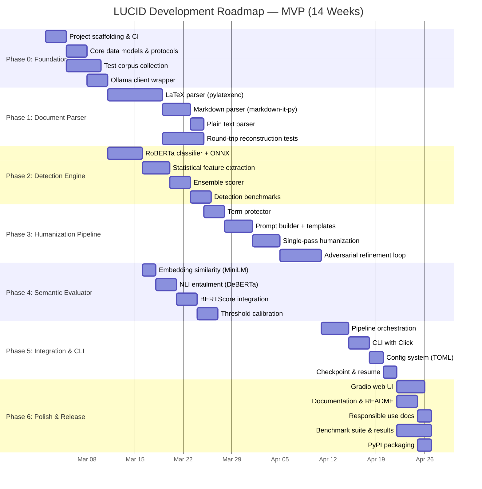
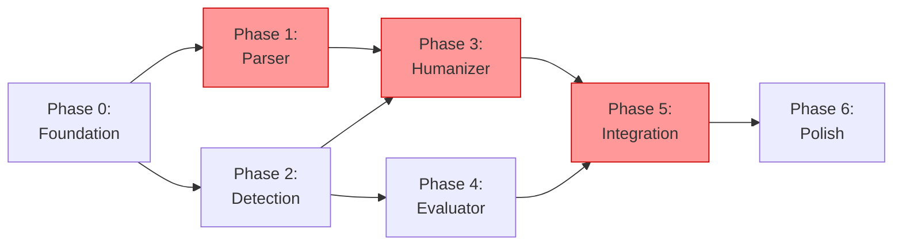

# LUCID: Development Roadmap

> **Version:** 0.1.0
> **Status:** Phase 6 complete — MVP release
> **Last Updated:** 2026-02-21

---

## 1. Roadmap Overview

The development is structured in 7 phases across approximately 14 weeks for a solo developer targeting an MVP. Each phase has clear entry criteria, exit criteria, deliverables, and risk mitigations. The critical path runs through Phase 1 (Parser) → Phase 3 (Humanizer) → Phase 5 (Integration).

### Phase Timeline



### Phase Dependencies



Red = critical path. Phase 2 and Phase 4 can be developed in parallel with non-blocking phases.

---

## 2. Phase 0: Foundation (Week 1–2)

### 2.1 Objectives

Stand up the project skeleton with CI, core abstractions, and external integrations so that all subsequent phases build on stable ground.

### 2.2 Tasks

| Task                                                                                                                                           | Effort | Deliverable                              |
| ---------------------------------------------------------------------------------------------------------------------------------------------- | ------ | ---------------------------------------- |
| Initialize repo with `pyproject.toml`, `uv` for dependency management                                                                          | 2h     | Buildable project                        |
| Set up GitHub Actions CI: lint (ruff), type check (mypy), test (pytest)                                                                        | 3h     | Green CI pipeline                        |
| Define core data models: `Chunk`, `ProseChunk`, `StructuralChunk`, `DetectionResult`, `ParaphraseResult`, `EvaluationResult`, `DocumentResult` | 4h     | `src/lucid/parser/chunk.py` + type stubs |
| Define protocols: `DocumentAdapter`, `Detector`, `Humanizer`, `Evaluator`                                                                      | 3h     | Abstract base classes                    |
| Implement Ollama client wrapper with health check, streaming, retry logic                                                                      | 6h     | `src/lucid/humanizer/ollama.py`          |
| Write Ollama integration tests (requires Ollama running)                                                                                       | 3h     | `tests/test_humanizer/test_ollama.py`    |
| Collect test corpus: 50 LaTeX papers from arXiv, 30 Markdown docs                                                                              | 4h     | `tests/corpus/` populated                |
| Generate AI text samples: 100 paragraphs from GPT-4 / Claude / Llama                                                                           | 3h     | `tests/corpus/ai_generated/`             |
| Implement TOML config loading with profile merging                                                                                             | 4h     | `src/lucid/config.py`                    |
| Create default config and profile configs                                                                                                      | 2h     | `config/` directory                      |

### 2.3 Entry Criteria

None — this is the starting phase.

### 2.4 Exit Criteria

- CI pipeline is green on every commit.
- `ollama_client.generate("Hello", model="phi3:3.8b")` returns a response.
- All core data models are defined with type annotations and basic serialization.
- Test corpus has at least 50 LaTeX files that compile successfully.
- Config system loads defaults, merges profiles, and accepts CLI overrides.

### 2.5 Risks & Mitigations

| Risk                                | Impact                    | Mitigation                                                   |
| ----------------------------------- | ------------------------- | ------------------------------------------------------------ |
| Test corpus quality varies widely   | Parse failures in Phase 1 | Pre-filter: only include papers that compile with `pdflatex` |
| Ollama API changes between versions | Client breaks             | Pin Ollama version in docs, use version-aware API calls      |

---

## 3. Phase 1: Document Parser (Weeks 3–5) — CRITICAL PATH

### 3.1 Objectives

Build the LaTeX and Markdown parsers that correctly isolate prose from structural elements, track byte/line positions, and support lossless reconstruction.

### 3.2 Tasks

| Task                                                                                                                                     | Effort | Deliverable                            |
| ---------------------------------------------------------------------------------------------------------------------------------------- | ------ | -------------------------------------- |
| **LaTeX parser core:** pylatexenc `latexwalker` integration, AST traversal, node type identification                                     | 12h    | `src/lucid/parser/latex.py`            |
| **Node classification engine:** Implement the full classification table from the system design (prose vs. structural for all node types) | 8h     | Classification logic in `latex.py`     |
| **Inline math extraction:** Detect `$...$`, `\(...\)` within prose nodes, replace with `⟨MATH_NNN⟩` placeholders, build restoration map  | 6h     | Math placeholder system                |
| **Position tracking:** Verify byte-accurate `pos`/`pos_end` from pylatexenc across 50 test documents                                     | 4h     | Position accuracy tests                |
| **LaTeX reconstructor:** Implement reverse-order position-based replacement algorithm                                                    | 4h     | `src/lucid/reconstructor/latex.py`     |
| **Round-trip test suite:** Parse → reconstruct (without modification) must produce byte-identical output for all 50 test documents       | 6h     | Regression test suite                  |
| **Markdown parser:** markdown-it-py token stream parsing, prose/structural classification, line-range tracking                           | 8h     | `src/lucid/parser/markdown.py`         |
| **Markdown reconstructor:** Line-range-based replacement algorithm                                                                       | 3h     | `src/lucid/reconstructor/markdown.py`  |
| **Plain text parser:** Paragraph segmentation, sentence splitting                                                                        | 3h     | `src/lucid/parser/plaintext.py`        |
| **Edge case hardening:** Custom environments, nested structures, verbatim regions, multi-column layouts                                  | 8h     | Edge case test coverage                |
| **Compilation validator:** pdflatex compilation check, error parsing, Markdown render verification                                       | 4h     | `src/lucid/reconstructor/validator.py` |

### 3.3 Entry Criteria

- Phase 0 complete: data models defined, test corpus collected.

### 3.4 Exit Criteria

- **LaTeX round-trip:** ≥95% of test corpus documents produce byte-identical output when parsed and reconstructed without modification.
- **Prose isolation:** Manual inspection of 10 documents confirms correct classification of all node types.
- **Math placeholders:** All inline math expressions in 10 test documents are correctly extracted and restorable.
- **Markdown round-trip:** ≥98% of test Markdown files produce identical output.
- **Compilation:** Reconstructed LaTeX files compile without errors for all documents that passed round-trip.

### 3.5 Technical Decisions

**pylatexenc vs. TexSoup:** pylatexenc is chosen over TexSoup because:

1. Position tracking (`pos`/`pos_end`) is native and reliable.
2. Typed node classes enable pattern matching in the classifier.
3. `LatexContextDb` allows registering custom macros.
4. Active maintenance (v3.0alpha with breaking improvements).

TexSoup's tree modification API is attractive but its known limitations (key-value argument parsing failures, custom environment handling) make it unsuitable for robust academic document processing.

**Position-based vs. AST reconstruction:** Position-based replacement is the core architectural choice. This must be validated early — if pylatexenc's position tracking proves unreliable for certain document structures, we need to know in Week 3, not Week 10.

### 3.6 Risks & Mitigations

| Risk                                                          | Impact                      | Likelihood | Mitigation                                                                                         |
| ------------------------------------------------------------- | --------------------------- | ---------- | -------------------------------------------------------------------------------------------------- |
| pylatexenc position tracking inaccurate for complex documents | Corrupted reconstruction    | Medium     | Validate against 50 documents in Week 3. Fall back to line-based replacement if needed.            |
| Custom LaTeX macros break parser                              | Unparseable regions         | High       | Implement "tolerant mode" — classify unparseable regions as structural and pass through unchanged. |
| Multi-file `\input{}` projects                                | Cannot process real papers  | Medium     | Defer to v1.1. Document limitation clearly. Single-file support only for MVP.                      |
| Markdown extensions (footnotes, definition lists)             | Incomplete Markdown support | Low        | Use markdown-it-py plugins progressively. Core CommonMark first, extensions later.                 |

---

## 4. Phase 2: Detection Engine (Weeks 4–6) — Parallel Track

### 4.1 Objectives

Implement the two-tier detection pipeline (RoBERTa classifier + statistical features) with ONNX optimization and ensemble scoring.

### 4.2 Tasks

| Task                                                                                                                            | Effort | Deliverable                                  |
| ------------------------------------------------------------------------------------------------------------------------------- | ------ | -------------------------------------------- |
| **RoBERTa classifier setup:** Download model, export to ONNX, verify CoreML EP on Apple Silicon                                 | 6h     | ONNX model + inference wrapper               |
| **Sliding window tokenization:** Handle chunks >512 tokens with overlapping windows                                             | 4h     | Window-based inference                       |
| **Statistical feature extraction:** Implement perplexity proxy (GPT-2 small), burstiness, TTR, hapax ratio, POS trigram entropy | 10h    | `src/lucid/detector/statistical.py`          |
| **Feature classifier training:** Train XGBoost on AI vs. human text features from test corpus                                   | 4h     | Trained classifier, saved model              |
| **Ensemble scorer:** Configurable weight combination of Tier 1 + Tier 2 scores                                                  | 3h     | `src/lucid/detector/ensemble.py`             |
| **Binoculars scaffolding:** Implement the interface and model loading (disabled by default)                                     | 4h     | `src/lucid/detector/binoculars.py`           |
| **Detection benchmark:** Run against full test corpus, measure TPR/FPR at various thresholds, generate ROC curves               | 6h     | Benchmark results, threshold recommendations |
| **Threshold calibration:** Determine optimal ensemble weights and decision boundaries                                           | 4h     | Updated default config                       |

### 4.3 Entry Criteria

- Phase 0 complete: core data models, Ollama client.
- AI-generated and human-written test paragraphs available.

### 4.4 Exit Criteria

- RoBERTa classifier runs via ONNX in <15ms per 512-token window on M1 Pro.
- Statistical features compute in <50ms per paragraph.
- Ensemble achieves >85% TPR at 5% FPR on test corpus.
- False positive rate on human text <5%.
- Binoculars module loads and produces scores (disabled by default, but functional).

### 4.5 Risks & Mitigations

| Risk                                                              | Impact                                | Likelihood | Mitigation                                                                                  |
| ----------------------------------------------------------------- | ------------------------------------- | ---------- | ------------------------------------------------------------------------------------------- |
| Pre-trained RoBERTa detector is stale (trained on GPT-2 era text) | Low accuracy on modern LLM output     | High       | Fine-tune on modern AI text (GPT-4, Claude, Llama 3) — adds 2–3 days.                       |
| GPT-2 small perplexity proxy is weak for modern text              | Statistical features less informative | Medium     | Consider using a small modern LM (Phi-2, 2.7B) for perplexity. Trade-off: ~1GB more memory. |
| ONNX CoreML EP not available on Linux                             | Linux users get slower inference      | Low        | Fall back to CPU EP. Document Apple Silicon optimization as optional.                       |

---

## 5. Phase 3: Humanization Pipeline (Weeks 6–9) — CRITICAL PATH

### 5.1 Objectives

Build the complete humanization chain: term protection → prompt construction → Ollama generation → adversarial refinement. This is the most complex module and the highest-risk phase.

### 5.2 Tasks

| Task                                                                                                                                    | Effort | Deliverable                           |
| --------------------------------------------------------------------------------------------------------------------------------------- | ------ | ------------------------------------- |
| **Term protector:** spaCy NER integration, citation regex extraction, custom term list, placeholder injection/restoration               | 8h     | `src/lucid/humanizer/term_protect.py` |
| **Prompt builder:** System prompt templates, few-shot example management, domain-adaptive example selection                             | 8h     | `src/lucid/humanizer/prompts.py`      |
| **Few-shot example curation:** Create 3–5 pairs of AI→human-revised text per domain (STEM, humanities, general)                         | 6h     | `config/examples/`                    |
| **Single-pass humanization:** Wire term protector → prompt builder → Ollama client → response parsing                                   | 6h     | Basic humanization working            |
| **Placeholder validation:** Post-generation check for all `⟨TERM_NNN⟩` and `⟨MATH_NNN⟩` markers                                         | 3h     | Validation logic                      |
| **Strategy system:** Implement 5 rotation strategies (standard, restructure, voice shift, vocabulary, reorder)                          | 6h     | `src/lucid/humanizer/strategies.py`   |
| **Adversarial refinement loop:** Implement detect → score → retry cycle with strategy rotation, max iterations, best-candidate tracking | 10h    | `src/lucid/humanizer/adversarial.py`  |
| **Humanization quality benchmarks:** Measure evasion rate, semantic preservation, latency across profiles and models                    | 8h     | Benchmark results                     |
| **Prompt tuning:** Iterate on prompts based on benchmark results, adjust temperature/sampling per profile                               | 6h     | Optimized prompt templates            |

### 5.3 Entry Criteria

- Phase 1 complete: Parser produces `ProseChunk` objects with position tracking.
- Phase 2 complete (at least Tier 1): Detection engine can score paraphrases.
- Ollama running with at least one 3B model pulled.

### 5.4 Exit Criteria

- Single-pass humanization produces semantically valid paraphrases for >80% of test paragraphs (embedding similarity >0.80).
- Adversarial loop reduces detection score below 0.30 for >70% of AI-generated paragraphs within 5 iterations.
- All placeholders (math, terms) are preserved in >95% of paraphrases.
- Latency: <5s per paragraph with 3B model, <15s with 8B model.
- Term protection correctly identifies and shields domain terms in 10 manually inspected documents.

### 5.5 Key Technical Challenges

**Challenge 1: LLM instruction following for placeholders.** Small models (3B) may struggle to preserve `⟨MATH_001⟩` tokens. Mitigation: use a distinctive placeholder format that tokenizes as a single sequence (tested with the target model's tokenizer), add explicit "DO NOT MODIFY" instructions, and validate + retry on failure.

**Challenge 2: Adversarial convergence.** The paragraph-level adversarial loop may not converge if the detector is very sensitive to the specific model's style. Mitigation: strategy rotation introduces sufficient diversity across iterations. If convergence fails after 5 iterations, return the best candidate with a warning.

**Challenge 3: Prompt sensitivity across models.** Different Ollama models respond differently to the same prompt. Mitigation: test core prompt templates against Phi-3, Qwen2.5, Llama 3.1, and Mistral. Use model-family-specific template adjustments if needed (stored in config).

### 5.6 Risks & Mitigations

| Risk                                                         | Impact                             | Likelihood | Mitigation                                                                                  |
| ------------------------------------------------------------ | ---------------------------------- | ---------- | ------------------------------------------------------------------------------------------- |
| 3B models produce low-quality paraphrases for technical text | Core value proposition compromised | Medium     | Benchmark early (Week 6). If quality is insufficient, adjust default profile to 7B minimum. |
| Adversarial loop doesn't converge within 5 iterations        | Low evasion rate                   | Medium     | Increase max iterations to 8, add more diverse strategies. Accept diminishing returns.      |
| Different Ollama models require different prompt formats     | Maintenance burden                 | High       | Abstract prompt templates per model family. Test top 4 models explicitly.                   |

---

## 6. Phase 4: Semantic Evaluator (Weeks 8–10) — Parallel Track

### 6.1 Objectives

Implement the three-stage semantic evaluation pipeline and calibrate thresholds for each stage.

### 6.2 Tasks

| Task                                                                                                            | Effort | Deliverable                          |
| --------------------------------------------------------------------------------------------------------------- | ------ | ------------------------------------ |
| **MiniLM embedding setup:** Load model, implement batch encoding, cosine similarity computation                 | 3h     | `src/lucid/evaluator/embedding.py`   |
| **DeBERTa NLI setup:** Load model (ONNX), implement bidirectional entailment check                              | 5h     | `src/lucid/evaluator/nli.py`         |
| **BERTScore integration:** Wrap `bert-score` library, configure rescaling, implement optional activation        | 4h     | `src/lucid/evaluator/bertscore.py`   |
| **Tiered pipeline orchestration:** Stage 1 → Stage 2 → Stage 3 with early exit, configurable thresholds         | 4h     | `src/lucid/evaluator/pipeline.py`    |
| **Term verification:** Post-evaluation placeholder and numerical value check                                    | 3h     | `src/lucid/evaluator/term_verify.py` |
| **Threshold calibration:** Run against 200+ original↔paraphrase pairs, determine optimal thresholds per stage   | 8h     | Calibrated thresholds in config      |
| **Edge case testing:** Technical text with jargon, mathematical descriptions, short paragraphs, long paragraphs | 4h     | Edge case test suite                 |

### 6.3 Entry Criteria

- Phase 2 complete: detection scores available for paraphrases.
- Some paraphrases available from Phase 3 development (even if Phase 3 is incomplete).

### 6.4 Exit Criteria

- Stage 1 (embedding) rejects <5% of semantically correct paraphrases (low false rejection rate).
- Stage 2 (NLI) correctly identifies >90% of factually inconsistent paraphrases as contradictions.
- Stage 3 (BERTScore) correlates with human quality judgments (manual check on 30 samples).
- Full evaluation pipeline adds <100ms average overhead per paragraph.
- Term verification catches all placeholder violations.

---

## 7. Phase 5: Integration & CLI (Weeks 10–12) — CRITICAL PATH

### 7.1 Objectives

Wire all modules into a complete pipeline, build the CLI interface, and implement the configuration system.

### 7.2 Tasks

| Task                                                                                                            | Effort | Deliverable                    |
| --------------------------------------------------------------------------------------------------------------- | ------ | ------------------------------ |
| **Pipeline orchestrator:** Connect parser → detector → humanizer → evaluator → reconstructor with state machine | 10h    | `src/lucid/pipeline.py`        |
| **Model lifecycle manager:** Load/unload models based on pipeline phase and memory availability                 | 6h     | `src/lucid/models/manager.py`  |
| **First-run model downloader:** Auto-download ONNX models, prompt Ollama pull for LLM                           | 4h     | `src/lucid/models/download.py` |
| **CLI implementation:** `lucid detect`, `lucid humanize`, `lucid pipeline`, `lucid config` subcommands          | 8h     | `src/lucid/cli.py`             |
| **Progress reporting:** Rich terminal output with per-chunk progress, detection scores, humanization status     | 4h     | Progress display               |
| **Checkpoint & resume:** JSON checkpoint after each chunk, resume from interruption                             | 4h     | Checkpoint system              |
| **Batch processing:** Process multiple files in a directory                                                     | 3h     | Batch mode in CLI              |
| **Output formatting:** Generate detection report (JSON + human-readable), annotated document, quality summary   | 4h     | Report generation              |
| **End-to-end integration tests:** Full pipeline on 10 LaTeX + 10 Markdown documents                             | 8h     | Integration test suite         |

### 7.3 CLI Design

```text
LUCID — AI Content Detection & Humanization Engine

COMMANDS:
  lucid detect <input>           Detect AI-generated content
    --profile <fast|balanced|quality>
    --output-format <json|text|annotated>
    --threshold <float>

  lucid humanize <input>         Humanize AI-detected content
    --profile <fast|balanced|quality>
    --output <path>
    --model <ollama-model-tag>
    --adversarial                  Enable adversarial refinement

  lucid pipeline <input>         Full detect → humanize → validate pipeline
    --profile <fast|balanced|quality>
    --output <path>
    --report <path>                Save detailed processing report
    --resume <checkpoint>          Resume from checkpoint

  lucid config                   Show current configuration
    --set <key> <value>            Set a configuration value
    --profile <name>               Show profile-specific config

  lucid models                   List available and required models
    --download                     Download all required models
    --check                        Verify Ollama models are pulled

GLOBAL FLAGS:
  --config <path>                  Custom config file
  --verbose / -v                   Increase log verbosity
  --quiet / -q                     Suppress non-essential output
```

### 7.4 Entry Criteria

- Phases 1–4 complete: all modules functional independently.

### 7.5 Exit Criteria

- `lucid pipeline sample.tex --profile balanced` produces a valid, humanized LaTeX document.
- `lucid detect sample.md` produces a JSON report with per-paragraph scores.
- Checkpoint/resume works across process restarts.
- All integration tests pass.
- Model downloader handles first-run setup without manual intervention.

---

## 8. Phase 6: Polish & Release (Weeks 12–14)

### 8.1 Objectives

Production-quality documentation, optional web UI, comprehensive benchmarks, and PyPI packaging.

### 8.2 Tasks

| Task                                                                                                                       | Effort | Deliverable           |
| -------------------------------------------------------------------------------------------------------------------------- | ------ | --------------------- |
| **Gradio web UI:** Upload document, select profile, view detection results, download humanized output                      | 10h    | `web/app.py`          |
| **README.md:** Installation, quickstart, configuration guide, model recommendations, screenshots                           | 6h     | README                |
| **RESPONSIBLE_USE.md:** Dual-use policy, legitimate use cases, ethical guidelines, EU AI Act considerations                | 4h     | Responsible use doc   |
| **API documentation:** Docstrings for all public interfaces, auto-generated with mkdocs                                    | 4h     | `docs/` site          |
| **Benchmark suite:** Automated detection accuracy, evasion rate, semantic preservation, latency across profiles and models | 8h     | `tests/benchmarks/`   |
| **Published benchmark results:** Tables and charts for README showing performance across detectors, models, document types | 4h     | Benchmark report      |
| **PyPI packaging:** Build wheel, configure `pyproject.toml` entry points, test `pip install lucid-ai`                      | 3h     | PyPI release          |
| **Example scripts:** Annotated examples for common workflows                                                               | 3h     | `examples/`           |
| **First-run experience:** Guided setup for Ollama installation, model pulling, config initialization                       | 4h     | `lucid setup` command |

### 8.3 Exit Criteria — MVP Release (v0.1.0)

- `pip install lucid-ai` works on macOS (Apple Silicon) and Linux (x86-64).
- `lucid setup` guides new users through Ollama installation and model pulling.
- `lucid pipeline input.tex --profile balanced` produces valid output for >90% of test corpus.
- README includes installation, quickstart, and at least one full worked example.
- Benchmark results are published and reproducible.
- RESPONSIBLE_USE.md is complete and prominently linked.

---

## 9. Post-MVP Roadmap (v1.x)

### 9.1 v1.1 — Robustness & Expansion (Weeks 15–20)

| Feature                                                                | Priority | Effort  |
| ---------------------------------------------------------------------- | -------- | ------- |
| Multi-file LaTeX project support (`\input{}`, `\include{}`)            | High     | 2 weeks |
| Binoculars fully integrated with auto memory management                | High     | 1 week  |
| QLoRA fine-tuning pipeline for custom humanization styles              | Medium   | 2 weeks |
| Model-specific prompt templates (auto-detected from Ollama model name) | Medium   | 1 week  |
| VS Code extension for inline detection highlighting                    | Medium   | 2 weeks |

### 9.2 v1.2 — Cloud Hybrid & Scale (Weeks 20–26)

| Feature                                                             | Priority | Effort  |
| ------------------------------------------------------------------- | -------- | ------- |
| Cloud API backend (Groq, Together.ai) for high-quality humanization | High     | 1 week  |
| Concurrent chunk processing (parallel Ollama requests)              | Medium   | 1 week  |
| Docker containerization with pre-loaded models                      | Medium   | 1 week  |
| API server mode (FastAPI) for integration into other tools          | Medium   | 2 weeks |
| Detection model auto-update from HuggingFace Hub                    | Low      | 1 week  |

### 9.3 v2.0 — Multi-Language & Advanced Features (Weeks 26+)

| Feature                                                           | Priority | Effort  |
| ----------------------------------------------------------------- | -------- | ------- |
| Multi-language support (starting with Western European languages) | High     | 4 weeks |
| Watermark detection and awareness (EU AI Act compliance)          | High     | 3 weeks |
| Document-level style transfer (match a target author's style)     | Medium   | 3 weeks |
| Interactive mode: highlight detected sections, humanize on click  | Medium   | 2 weeks |
| Plagiarism cross-check integration (optional)                     | Low      | 2 weeks |
| Custom detector training pipeline (bring-your-own-data)           | Low      | 3 weeks |

---

## 10. Risk Register

### 10.1 Technical Risks

| #   | Risk                                                                     | Likelihood | Impact   | Phase | Mitigation                                                                            |
| --- | ------------------------------------------------------------------------ | ---------- | -------- | ----- | ------------------------------------------------------------------------------------- |
| T1  | pylatexenc position tracking fails on complex documents                  | Medium     | Critical | P1    | Validate against 50 papers in Week 3. Fall back to line-based replacement.            |
| T2  | 3B models produce insufficient paraphrase quality for academic text      | Medium     | High     | P3    | Benchmark in Week 6. If insufficient, shift default to 7B minimum.                    |
| T3  | Adversarial loop doesn't converge in 5 iterations                        | Medium     | Medium   | P3    | Increase to 8 iterations, add more strategies, accept partial success.                |
| T4  | Semantic evaluator rejects too many valid paraphrases (false rejections) | Medium     | Medium   | P4    | Lower thresholds iteratively. Provide "lenient" profile.                              |
| T5  | ONNX export fails for specific model architectures                       | Low        | Medium   | P2    | Fall back to PyTorch inference (2–3× slower but functional).                          |
| T6  | Memory pressure on 16GB with 8B model + detection models                 | Medium     | High     | P5    | Implement sequential model loading. Document 32GB recommendation for quality profile. |
| T7  | Ollama API rate limits or timeout under sustained load                   | Low        | Medium   | P3    | Implement backoff, chunked processing, and timeout configuration.                     |

### 10.2 Ecosystem Risks

| #   | Risk                                                | Likelihood | Impact | Mitigation                                                  |
| --- | --------------------------------------------------- | ---------- | ------ | ----------------------------------------------------------- |
| E1  | Ollama breaking API changes                         | Low        | High   | Pin supported Ollama version range, abstract API layer.     |
| E2  | HuggingFace model takedowns                         | Low        | Medium | Host critical model weights as project artifacts.           |
| E3  | Model license changes (Llama, Gemma)                | Low        | Medium | Default to MIT/Apache models (Phi, Qwen, Mistral).          |
| E4  | Detection models become obsolete as new LLMs emerge | High       | Medium | Design for easy model swapping. Publish re-training guides. |

### 10.3 Legal/Ethical Risks

| #   | Risk                                         | Likelihood | Impact | Mitigation                                                                      |
| --- | -------------------------------------------- | ---------- | ------ | ------------------------------------------------------------------------------- |
| L1  | EU AI Act Article 50 compliance requirements | High       | High   | Do not target watermarks. Frame as writing assistant. Legal review before v1.0. |
| L2  | Academic integrity backlash                  | Medium     | Medium | Strong responsible use docs. Frame around false positive defense.               |
| L3  | Detection platform ToS violations            | Low        | Low    | Use only OSS detectors, never commercial APIs for adversarial training.         |

---

## 11. Decision Log

Track key architectural decisions and their rationale for future reference.

| Date       | Decision                                           | Alternatives Considered                      | Rationale                                                                                                                     |
| ---------- | -------------------------------------------------- | -------------------------------------------- | ----------------------------------------------------------------------------------------------------------------------------- |
| 2026-02-20 | Use pylatexenc over TexSoup for LaTeX parsing      | TexSoup, plasTeX, LaTeXML                    | Position tracking, typed nodes, active maintenance. TexSoup lacks key-value arg parsing.                                      |
| 2026-02-20 | Ollama as LLM backend, native ONNX for detection   | All-native HF, all-Ollama, vLLM, MLX         | Ollama provides model management and user configurability. Detection needs logit access Ollama doesn't provide.               |
| 2026-02-20 | Position-based replacement over AST reconstruction | AST round-trip, regex replacement            | Byte-level fidelity, avoids whitespace drift, preserves document formatting exactly.                                          |
| 2026-02-20 | Paragraph-level adversarial loop over token-level  | Token-level detector-guided decoding         | Ollama API doesn't expose logprobs. Paragraph-level is architecturally simpler and model-agnostic.                            |
| 2026-02-20 | TOML for configuration over YAML/JSON              | YAML, JSON, INI                              | TOML is typed, human-readable, and has stdlib support in Python 3.11+.                                                        |
| 2026-02-20 | English-only for v1.0                              | Multi-language from start                    | Reduces complexity by 60%+. Detection models, evaluation calibration, and prompts all simplify.                               |
| 2026-02-20 | MiniLM + DeBERTa + BERTScore tiered evaluation     | Single metric (BERTScore only), LLM-as-judge | Tiered approach optimizes latency (95% of cases resolved by fast stages). LLM-as-judge would require additional Ollama calls. |
| 2026-02-20 | Phi-3 / Qwen2.5 as default models over Llama       | Llama 3.1, Mistral, Gemma                    | MIT/Apache licensing avoids commercial restrictions. Comparable quality at target parameter counts.                           |

---

## 12. Success Criteria — What "Done" Looks Like

### v0.1.0 MVP

The system is considered MVP-complete when a user can:

1. Install via `pip install lucid-ai`
2. Run `lucid setup` to configure Ollama and download models
3. Run `lucid pipeline paper.tex --profile balanced` on an arXiv LaTeX paper
4. Receive a humanized LaTeX file that compiles without errors
5. Receive a JSON report showing per-paragraph detection scores (before and after)
6. Receive semantic preservation scores confirming meaning fidelity
7. Observe that >70% of previously AI-flagged paragraphs now score below the detection threshold

All of the above must work completely offline on a 16GB Apple Silicon MacBook with no internet connection after initial model setup.
