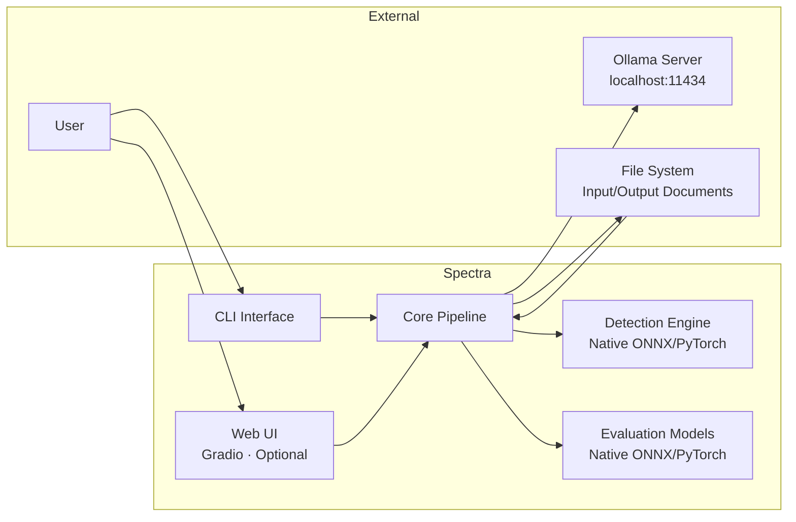
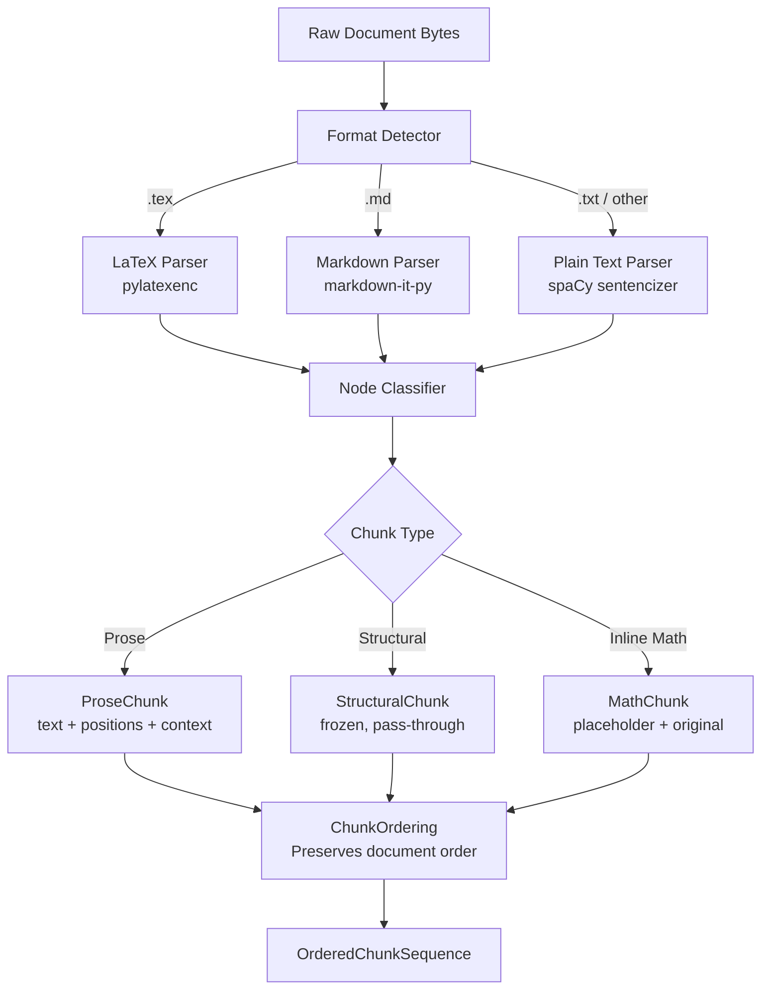
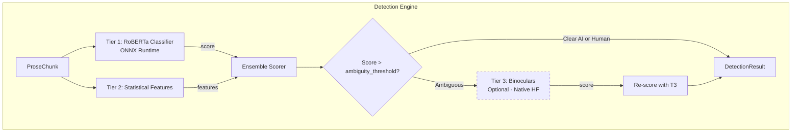
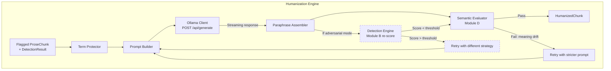
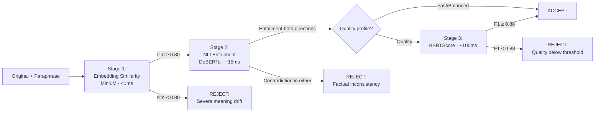
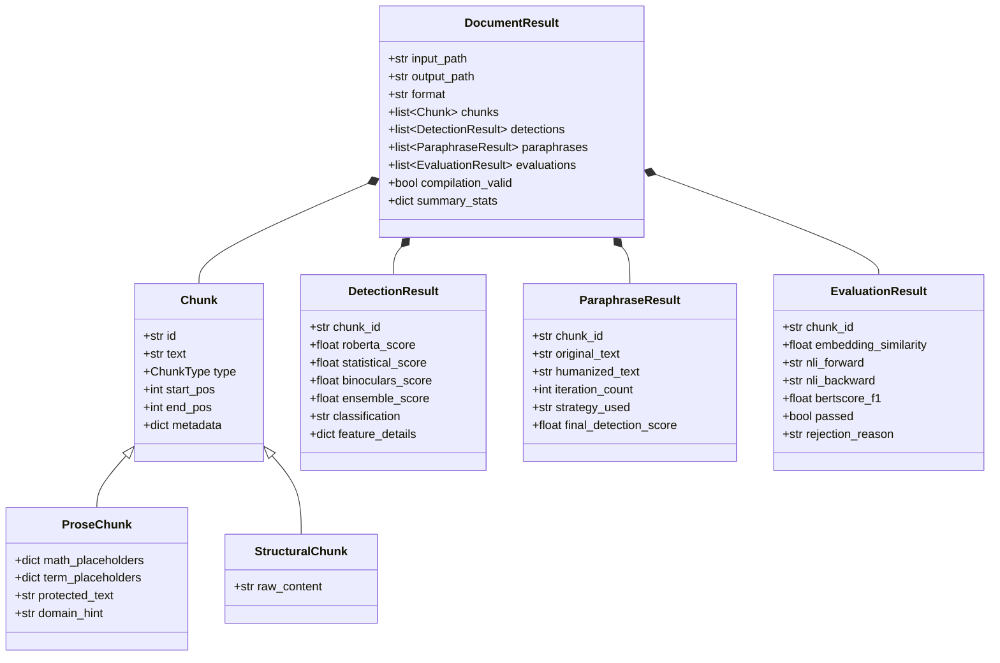
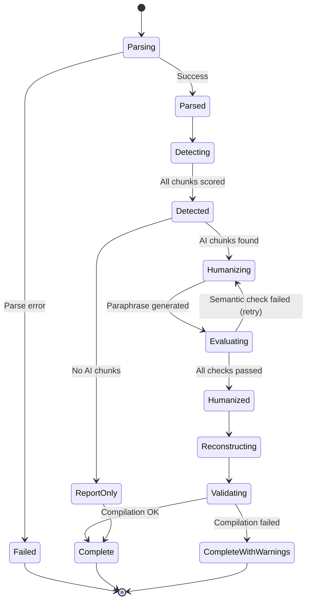
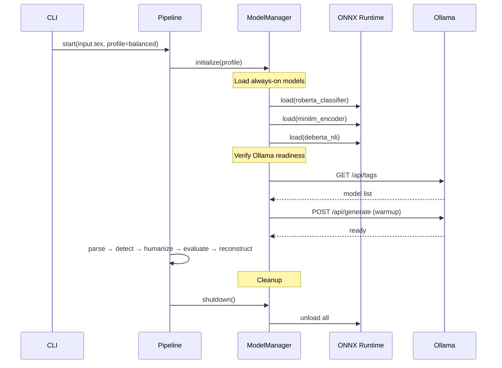

# Spectra: Detailed System Design & Architecture

> **Version:** 0.1.0-design
> **Status:** Pre-development
> **Last Updated:** 2026-02-20

---

## Table of Contents

1. [System Boundary & Context](#1-system-boundary--context)
2. [Module A: Document Parser](#2-module-a-document-parser)
3. [Module B: Detection Engine](#3-module-b-detection-engine)
4. [Module C: Humanization Engine](#4-module-c-humanization-engine)
5. [Module D: Semantic Evaluator](#5-module-d-semantic-evaluator)
6. [Module E: Document Reconstructor](#6-module-e-document-reconstructor)
7. [Configuration System](#7-configuration-system)
8. [Data Models](#8-data-models)
9. [Inference Infrastructure](#9-inference-infrastructure)
10. [Error Handling & Recovery](#10-error-handling--recovery)
11. [Testing Strategy](#11-testing-strategy)
12. [Project Structure](#12-project-structure)

---

## 1. System Boundary & Context

### 1.1 Context Diagram



### 1.2 Dual Inference Backend Rationale

The system uses two inference backends for fundamentally different reasons:

**Ollama (paraphrasing LLM):** Provides model management, quantization, GPU offloading, and a stable API. Users configure which model to use. The system sends prompts and receives completions — no logit access needed.

**Native ONNX/PyTorch (detection + evaluation models):** RoBERTa classifiers, DeBERTa NLI, MiniLM embeddings, and Binoculars all require either logit-level access (for probability scoring) or produce embeddings (for similarity computation). These are BERT-class models (86M–355M params) that run faster on CPU via ONNX than through any LLM serving framework.

This separation is not a compromise — it's the correct architecture. Detection models and LLM paraphrasers have fundamentally different inference patterns, model sizes, and API requirements.

### 1.3 Assumptions

- Ollama is installed and running on `localhost:11434` before Spectra launches.
- At least one compatible LLM has been pulled via `ollama pull`.
- Python 3.11+ runtime with ~2GB disk for detection model weights.
- Input documents are syntactically valid (LaTeX compiles, Markdown renders).
- English language content only.

---

## 2. Module A: Document Parser

### 2.1 Purpose

Transform input documents into a sequence of typed, position-tracked chunks that downstream modules can process independently. The parser's contract: **any chunk marked as "prose" can be safely replaced with new text of arbitrary length, and the reconstructor will produce a valid document.**

### 2.2 Architecture



### 2.3 LaTeX Parser — Detailed Design

**Library:** `pylatexenc` v3.x (`latexwalker` module)

**Parsing strategy:** Full document walk producing typed node tree. Each node carries `pos` (start byte offset) and `pos_end` (end byte offset) relative to the raw input string.

**Node classification rules:**

| Node Type                                                                    | Classification                     | Rationale                       |
| ---------------------------------------------------------------------------- | ---------------------------------- | ------------------------------- |
| `LatexCharsNode` inside `\begin{document}`                                   | **Prose**                          | Raw paragraph text              |
| `LatexCharsNode` inside `\section{}` arg                                     | **Prose**                          | Section title text              |
| `LatexCharsNode` inside `\caption{}` arg                                     | **Prose**                          | Figure/table caption text       |
| `LatexCharsNode` inside `\item`                                              | **Prose**                          | List item text                  |
| `LatexCharsNode` inside `\footnote{}`                                        | **Prose**                          | Footnote text                   |
| `LatexCharsNode` inside `\textbf{}`, `\emph{}`, `\textit{}`                  | **Prose**                          | Styled text (style preserved)   |
| `LatexMathNode` (any: `$`, `$$`, `\(`, `\[`)                                 | **Structural**                     | Math expressions — never modify |
| `LatexEnvironmentNode` for `equation`, `align`, `gather`, etc.               | **Structural**                     | Math environments               |
| `LatexEnvironmentNode` for `table`, `tabular`                                | **Structural**                     | Tables                          |
| `LatexEnvironmentNode` for `figure`                                          | **Structural** (except `\caption`) | Figures                         |
| `LatexEnvironmentNode` for `verbatim`, `lstlisting`, `minted`                | **Structural**                     | Code listings                   |
| `LatexMacroNode` for `\cite`, `\citep`, `\citet`, `\ref`, `\label`, `\eqref` | **Structural**                     | References                      |
| `LatexMacroNode` for `\usepackage`, `\documentclass`, `\newcommand`          | **Structural**                     | Preamble commands               |
| `LatexMacroNode` for `\includegraphics`, `\input`, `\include`                | **Structural**                     | File inclusions                 |
| `LatexEnvironmentNode` for `thebibliography`, `\bibliography`                | **Structural**                     | Bibliography                    |
| `LatexCommentNode`                                                           | **Structural**                     | LaTeX comments                  |
| Everything before `\begin{document}`                                         | **Structural**                     | Entire preamble                 |

**Inline math within prose:** When a `LatexCharsNode` (prose) contains adjacent `LatexMathNode` siblings, the prose chunk records math positions as embedded placeholders:

```
Original: "The loss function $\mathcal{L}$ converges in $O(n \log n)$ time."

ProseChunk:
  text: "The loss function ⟨MATH_001⟩ converges in ⟨MATH_002⟩ time."
  math_placeholders: {
    "⟨MATH_001⟩": "$\\mathcal{L}$",
    "⟨MATH_002⟩": "$O(n \\log n)$"
  }
  byte_positions: [(start, end)]  # of the full prose span including math
```

The LLM prompt explicitly instructs: "Text contains mathematical placeholders like ⟨MATH_001⟩. Preserve them exactly as-is in your output."

**Edge cases requiring special handling:**

1. **Nested environments.** `\begin{theorem}...\end{theorem}` contains prose that should be paraphrased but the environment boundaries must be preserved. The parser descends into environments and classifies their children independently.
2. **Custom macros.** `\newcommand{\myterm}[1]{\textbf{#1}}` — the parser cannot expand custom macros without a full TeX engine. Strategy: classify unknown macros as structural by default, with a user-configurable allowlist for custom macros known to contain prose.
3. **`\input{}` / `\include{}`.** Multi-file LaTeX projects require recursive parsing. Phase 1 supports single-file only; multi-file support is a v1.1 feature.
4. **Encoding.** Assume UTF-8. Byte position tracking must account for multi-byte characters — use `pylatexenc`'s native position tracking rather than computing offsets from string lengths.

### 2.4 Markdown Parser — Detailed Design

**Library:** `markdown-it-py` v3.x

**Parsing strategy:** Token stream with type classification. markdown-it-py produces a flat token list with nesting depth, type labels, and source map information (line numbers).

**Token classification:**

| Token Type                                       | Classification |
| ------------------------------------------------ | -------------- |
| `paragraph_open` / `paragraph_close` + `inline`  | **Prose**      |
| `heading_open` / `heading_close` + `inline`      | **Prose**      |
| `list_item_open` / `list_item_close` + content   | **Prose**      |
| `blockquote_open` / `blockquote_close` + content | **Prose**      |
| `code_block`, `fence`                            | **Structural** |
| `math_block`, `math_inline` (via plugin)         | **Structural** |
| `html_block`, `html_inline`                      | **Structural** |
| `image`                                          | **Structural** |
| `table_open` / `table_close`                     | **Structural** |
| `hr`                                             | **Structural** |
| Front matter (YAML)                              | **Structural** |

**Round-trip strategy:** Unlike LaTeX (where position-based replacement works), Markdown round-tripping uses line-number-based replacement. markdown-it-py's `map` attribute on tokens provides `[startLine, endLine]` for each token. The reconstructor replaces line ranges in the original document.

### 2.5 Plain Text Parser

**Library:** `spaCy` sentencizer (rule-based, no ML model needed) or regex-based paragraph splitting.

**Strategy:** Split on double newlines for paragraphs, use spaCy's sentencizer for sentence-level granularity when needed. Each paragraph becomes a ProseChunk with line-based position tracking.

---

## 3. Module B: Detection Engine

### 3.1 Architecture



### 3.2 Tier 1: RoBERTa Classifier

**Model:** `roberta-base` fine-tuned on AI vs. human text classification (e.g., `openai-community/roberta-base-openai-detector` or custom-trained).

**Deployment:** Exported to ONNX format for CPU-optimized inference via ONNX Runtime with CoreML execution provider on Apple Silicon.

**Input:** Tokenized prose chunk (max 512 tokens per inference, with sliding window for longer chunks).

**Output:** `P(AI)` ∈ [0.0, 1.0] — probability that the input is AI-generated.

**Sliding window for long text:** For chunks exceeding 512 tokens:

1. Split into overlapping windows (stride = 256 tokens).
2. Run inference on each window.
3. Aggregate: `score = max(window_scores)` (conservative — any window flagged = chunk flagged).

**ONNX export pipeline:**

```
torch model → torch.onnx.export() → onnxruntime.InferenceSession(
    providers=["CoreMLExecutionProvider", "CPUExecutionProvider"]
)
```

Expected latency: **8–15ms per 512-token window** on M1 Pro CPU.

### 3.3 Tier 2: Statistical Features

Lightweight feature extraction that provides interpretability and catches patterns classifiers miss.

**Features computed per chunk:**

| Feature                      | Description                                                           | AI Signature          |
| ---------------------------- | --------------------------------------------------------------------- | --------------------- |
| **Perplexity proxy**         | Mean negative log-likelihood under a reference LM (GPT-2 small, 124M) | Low = more AI-like    |
| **Burstiness**               | Coefficient of variation of sentence lengths within chunk             | Low = more AI-like    |
| **Type-Token Ratio (TTR)**   | Unique words / total words                                            | Low = more AI-like    |
| **Hapax Legomena Ratio**     | Words appearing exactly once / total words                            | Low = more AI-like    |
| **Mean sentence length**     | Average words per sentence                                            | Stable = more AI-like |
| **Sentence length variance** | Variance of words per sentence                                        | Low = more AI-like    |
| **POS trigram entropy**      | Shannon entropy of POS tag trigram distribution                       | Low = more AI-like    |

**Perplexity proxy implementation:** Rather than running a full LLM for true perplexity (which requires logprobs), use GPT-2 small (124M params, ~500MB) via HuggingFace Transformers to compute per-token log-likelihoods. This model is small enough to always be loaded alongside other detection models. Alternatively, use a pre-computed frequency-based proxy (less accurate but zero model overhead).

**Feature combination:** A lightweight gradient-boosted classifier (XGBoost or LightGBM, <1MB) trained on the same AI vs. human dataset as the RoBERTa model. This produces a separate `P(AI)` score that's combined with Tier 1 in the ensemble.

### 3.4 Tier 3: Binoculars (Optional Deep Analysis)

**Method:** Compute the ratio of perplexity under an "observer" model to cross-perplexity under a "performer" model. When observer and performer are closely related (e.g., same base model, one instruction-tuned), the ratio diverges sharply for AI-generated text.

**Implementation with consumer hardware constraints:**

The original Binoculars paper uses Falcon-7B and Falcon-7B-Instruct (~14GB total). On 16GB systems, this is too large to coexist with the paraphrasing model. Options:

| Configuration | Model Pair                            | Memory  | Accuracy                          |
| ------------- | ------------------------------------- | ------- | --------------------------------- |
| **Full**      | Falcon-7B + Falcon-7B-Instruct (Q4)   | ~7 GB   | Original paper accuracy           |
| **Compact**   | Phi-3-mini + Phi-3-mini-instruct (Q4) | ~5 GB   | ~90% of full accuracy (estimated) |
| **Minimal**   | GPT-2 medium + GPT-2 (fine-tuned)     | ~1.5 GB | ~75% of full accuracy (estimated) |

**Recommendation:** Default to "Compact" configuration. Load Binoculars models on-demand, unloading the Ollama paraphrasing model first on 16GB systems. Use sequential execution with `ollama stop` before loading Binoculars, then restart Ollama model after detection completes.

**This tier is behind a feature flag and disabled by default.** It activates only when:

- User explicitly enables it in config
- Ensemble score from Tier 1+2 falls in the ambiguity range (e.g., 0.35–0.65)
- System has sufficient available memory

### 3.5 Ensemble Scorer

Combines Tier 1 and Tier 2 scores into a final detection result.

**Scoring formula (configurable weights):**

```
final_score = w1 * roberta_score + w2 * statistical_score
where w1 + w2 = 1.0

Default: w1 = 0.7, w2 = 0.3
```

If Tier 3 is activated:

```
final_score = w1 * roberta_score + w2 * statistical_score + w3 * binoculars_score
where w1 + w2 + w3 = 1.0

Default with T3: w1 = 0.4, w2 = 0.15, w3 = 0.45
```

**Decision thresholds (configurable):**

| Score Range | Classification | Action                                               |
| ----------- | -------------- | ---------------------------------------------------- |
| 0.0 – 0.30  | Human          | No humanization needed                               |
| 0.30 – 0.65 | Ambiguous      | Humanization recommended (optionally trigger Tier 3) |
| 0.65 – 1.0  | AI-generated   | Humanization strongly recommended                    |

---

## 4. Module C: Humanization Engine

### 4.1 Architecture



### 4.2 Term Protector

Before any text reaches the LLM, domain-specific terms are identified and shielded with unique placeholders.

**Term identification sources (in priority order):**

1. **Math placeholders** already extracted by the parser (e.g., `⟨MATH_001⟩`).
2. **Citation markers** (e.g., `[Author, 2024]`, `(Smith et al., 2023)`) — regex-based extraction.
3. **Named entities** — spaCy NER for ORG, PERSON, GPE, PRODUCT entities.
4. **User-defined term list** — custom terms provided via config (e.g., method names, dataset names, acronyms).
5. **Capitalized multi-word phrases** — heuristic for method names like "Transformer Architecture" or "Monte Carlo Tree Search".

**Placeholder format:** `⟨TERM_NNN⟩` where NNN is a zero-padded index. The LLM prompt explicitly instructs placeholder preservation.

**Post-paraphrase validation:** After the LLM returns, verify all placeholders are present in the output. If any are missing, the paraphrase is rejected and retried.

### 4.3 Prompt Builder

Constructs few-shot prompts tailored to the content type and quality profile.

**Prompt template structure:**

```
SYSTEM:
You are an expert academic editor specializing in improving the naturalness
and readability of technical writing. Rewrite the following paragraph to
sound more natural and human-written while preserving all technical meaning,
factual claims, and logical structure.

RULES:
- Vary sentence lengths naturally (mix short and long)
- Use occasional first-person hedging ("we observe", "it appears")
- Introduce minor stylistic imperfections (parenthetical asides, em-dashes)
- Preserve all terms marked with ⟨TERM_NNN⟩ exactly as-is
- Preserve all mathematical placeholders ⟨MATH_NNN⟩ exactly as-is
- Do NOT add new information or remove existing claims
- Maintain the same level of technical precision

FEW-SHOT EXAMPLES:
[2-3 pairs of AI-text → human-revised-text from the target domain]

INPUT:
{protected_prose_chunk}

OUTPUT:
```

**Domain-adaptive few-shot selection:** The system includes pre-built example sets for common domains:

| Domain        | Example Source              | Characteristics                            |
| ------------- | --------------------------- | ------------------------------------------ |
| STEM research | arXiv papers + human edits  | Technical jargon, passive voice acceptable |
| Humanities    | Journal articles            | Active voice, complex argumentation        |
| General/blog  | Human-written blog posts    | Conversational, variable structure         |
| Business      | Annual reports, whitepapers | Formal but direct                          |

The system auto-detects domain from document metadata (LaTeX class, keywords) or falls back to "general."

**Quality profile prompt variations:**

- **Fast:** Minimal system prompt, zero few-shot examples, temperature 0.7.
- **Balanced:** Full system prompt, 2 few-shot examples, temperature 0.6.
- **Quality:** Full system prompt, 3 few-shot examples, temperature 0.5, explicit "vary sentence structure" instruction.

### 4.4 Ollama Client

**API endpoint:** `POST http://localhost:11434/api/generate`

**Key parameters:**

```json
{
  "model": "qwen2.5:3b",
  "prompt": "<constructed_prompt>",
  "stream": true,
  "options": {
    "temperature": 0.6,
    "top_p": 0.9,
    "top_k": 40,
    "repeat_penalty": 1.1,
    "num_predict": 512,
    "num_ctx": 4096
  }
}
```

**Streaming handling:** Responses are streamed token-by-token. The client accumulates tokens and detects completion via Ollama's `done: true` field. Streaming enables progress reporting for the UI.

**Retry logic:**

- **Timeout:** 60s per paragraph (configurable). If exceeded, retry with reduced `num_predict`.
- **Ollama unavailable:** Retry with exponential backoff (1s, 2s, 4s), max 3 attempts, then fail the chunk gracefully.
- **Empty response:** Retry once with slightly higher temperature (+0.1).
- **Malformed response:** (missing placeholders, truncated) Retry up to 2× with explicit "complete the full paragraph" instruction.

**Health check:** Before pipeline execution, verify Ollama is running and the configured model is available:

```
GET http://localhost:11434/api/tags → verify model in list
GET http://localhost:11434/api/ps → verify model is loaded or can be loaded
```

### 4.5 Adversarial Refinement Loop

**This is the paragraph-level adversarial approach** necessitated by Ollama's API constraints (no token-level logprob access).

**Algorithm:**

```
function adversarial_humanize(chunk, max_iterations=5):
    for i in 1..max_iterations:
        strategy = select_strategy(i, previous_scores)
        prompt = build_prompt(chunk, strategy)
        candidate = ollama_generate(prompt)

        if not validate_placeholders(candidate):
            continue  # retry, placeholders broken

        semantic_ok = evaluate_semantics(chunk.original, candidate)
        if not semantic_ok:
            continue  # retry, meaning drifted too far

        detection_score = detect(candidate)  # Tier 1 + Tier 2
        if detection_score < threshold:
            return candidate  # success

        # Adapt strategy for next iteration
        previous_scores.append(detection_score)

    return best_candidate  # return lowest-scoring candidate even if above threshold
```

**Strategy rotation across iterations:**

| Iteration | Strategy                   | Prompt Modification                                                                                                |
| --------- | -------------------------- | ------------------------------------------------------------------------------------------------------------------ |
| 1         | Standard paraphrase        | Default prompt                                                                                                     |
| 2         | Sentence restructuring     | "Significantly vary sentence lengths. Use some very short sentences. Combine some into longer compound sentences." |
| 3         | Voice shifting             | "Rewrite using more active voice. Add hedging language like 'it seems' or 'arguably'."                             |
| 4         | Vocabulary diversification | "Use less common synonyms. Avoid overly predictable word choices."                                                 |
| 5         | Structural reorganization  | "Reorder the points in this paragraph while maintaining logical flow."                                             |

**Convergence:** In testing against the NeurIPS 2025 adversarial paraphrasing paper's results, paragraph-level approaches typically converge in 2–3 iterations for most content, with diminishing returns after iteration 4. The 5-iteration cap balances quality against latency.

---

## 5. Module D: Semantic Evaluator

### 5.1 Three-Stage Pipeline



### 5.2 Stage 1: Embedding Cosine Similarity

**Model:** `sentence-transformers/all-MiniLM-L6-v2` (22.7M params, ~90MB)

**Operation:** Encode both original and paraphrase into 384-dim vectors, compute cosine similarity.

**Threshold:** ≥ 0.80 (configurable via `eval.embedding_threshold`).

**Why this threshold:** Cosine similarity of 0.80 with MiniLM allows for significant lexical divergence (needed for detection evasion) while catching catastrophic semantic failures. Below 0.75, paraphrases are almost certainly saying something different. Above 0.90, the paraphrase is too close to the original to affect detection scores.

**Latency:** <1ms per pair on CPU. This stage is essentially free.

### 5.3 Stage 2: NLI Bidirectional Entailment

**Model:** `MoritzLaurer/DeBERTa-v3-base-mnli-fever-docnli-ling-2c` (86M params, ~800MB)

**Why this specific model:** Trained on 8 NLI datasets including DocNLI (long document pairs), uses binary classification (entailment/not-entailment) which simplifies thresholding versus 3-class NLI models. DeBERTa-v3 uses disentangled attention which captures position-dependent content relationships better than BERT/RoBERTa.

**Bidirectional check:**

1. `NLI(original → paraphrase)`: Does the original entail the paraphrase? (No information added?)
2. `NLI(paraphrase → original)`: Does the paraphrase entail the original? (No information lost?)

Both must classify as "entailment." If either returns "not-entailment," the paraphrase is rejected as semantically inconsistent.

**Latency:** ~10–20ms per direction, ~30ms total per pair on CPU via ONNX.

### 5.4 Stage 3: BERTScore (Quality Tier Only)

**Model:** `microsoft/deberta-xlarge-mnl` (reference implementation). Falls back to `microsoft/deberta-large-mnli` on memory-constrained systems.

**Operation:** Token-level contextual embedding alignment between original and paraphrase. Produces Precision, Recall, and F1 scores.

**Configuration:**

```python
bertscore.score(
    cands=[paraphrase],
    refs=[original],
    lang="en",
    rescale_with_baseline=True,  # Normalize against random baseline
    model_type="microsoft/deberta-xlarge-mnli"
)
```

**Threshold:** F1 ≥ 0.88 (with baseline rescaling). This is strict but appropriate for academic content where subtle meaning shifts matter.

**Latency:** ~50–150ms per pair on CPU. Only activated in "quality" profile.

### 5.5 Domain Term Verification (Cross-Cutting)

After all semantic stages pass, a final structural check verifies:

1. All `⟨TERM_NNN⟩` placeholders are present in the paraphrase.
2. All `⟨MATH_NNN⟩` placeholders are present and correctly positioned.
3. No new technical terms have been introduced that weren't in the original.
4. Numerical values mentioned in prose (e.g., "achieves 95% accuracy") are unchanged.

This is implemented as regex-based validation — no ML model needed, runs in microseconds.

---

## 6. Module E: Document Reconstructor

### 6.1 Position-Based Replacement (LaTeX)

**Algorithm:**

```
function reconstruct_latex(original_bytes, chunks):
    # Process chunks in REVERSE position order to maintain offset validity
    sorted_chunks = sort(chunks, key=lambda c: c.end_pos, reverse=True)

    result = original_bytes
    for chunk in sorted_chunks:
        if chunk.was_modified:
            # Restore math placeholders
            new_text = restore_placeholders(chunk.humanized_text, chunk.math_map)
            # Restore term placeholders
            new_text = restore_placeholders(new_text, chunk.term_map)
            # Replace bytes at exact positions
            result = result[:chunk.start_pos] + new_text + result[chunk.end_pos:]

    return result
```

**Critical detail — reverse order replacement:** Replacing from the end of the document backward ensures that byte offsets for earlier chunks remain valid. Forward replacement would invalidate all subsequent offsets when a replacement changes text length.

**Whitespace handling:** If the paraphrased text is significantly shorter or longer than the original, no adjustment is made to surrounding whitespace. LaTeX handles variable-length content gracefully in most contexts. The exception is fixed-width environments (e.g., `tabular` columns), which the parser classifies as structural and never modifies.

### 6.2 Line-Based Replacement (Markdown)

Markdown reconstruction uses line ranges from markdown-it-py's token `map` attribute:

```
function reconstruct_markdown(original_lines, chunks):
    result_lines = list(original_lines)
    # Process in reverse line order
    for chunk in sorted(chunks, key=lambda c: c.start_line, reverse=True):
        if chunk.was_modified:
            new_text = restore_placeholders(chunk.humanized_text, chunk.term_map)
            new_lines = new_text.split('\n')
            result_lines[chunk.start_line:chunk.end_line] = new_lines
    return '\n'.join(result_lines)
```

### 6.3 Compilation Validation

**LaTeX:** After reconstruction, attempt compilation via `pdflatex` (if available on the system):

```bash
pdflatex -interaction=nonstopmode -halt-on-error output.tex
```

Parse the log file for errors. If compilation fails, report the specific error and the chunk that likely caused it (by matching error line numbers to chunk positions).

**Markdown:** Render via markdown-it-py and verify:

- All code blocks are properly fenced.
- All inline math delimiters are balanced.
- No unclosed HTML tags.
- Image references still resolve.

**Compilation validation is advisory, not blocking.** The system reports failures but still produces output, allowing users to fix edge cases manually.

---

## 7. Configuration System

### 7.1 Configuration File Format

**Format:** TOML (human-readable, typed, well-supported in Python via `tomllib`).

**Location:** `~/.config/spectra/config.toml` (XDG-compliant) with CLI override.

### 7.2 Configuration Schema

```toml
[general]
profile = "balanced"           # "fast" | "balanced" | "quality"
language = "en"                # English only for v1.0
log_level = "info"             # "debug" | "info" | "warn" | "error"
output_dir = "./spectra_output"

[ollama]
host = "http://localhost:11434"
timeout_seconds = 60
health_check_on_start = true

[ollama.models]
fast = "phi3:3.8b"
balanced = "qwen2.5:7b"
quality = "llama3.1:8b"

[detection]
enabled = true
roberta_model = "roberta-base-openai-detector"   # HuggingFace model ID
use_statistical = true
use_binoculars = false                            # Disabled by default
ensemble_weights = { roberta = 0.7, statistical = 0.3 }
ensemble_weights_with_binoculars = { roberta = 0.4, statistical = 0.15, binoculars = 0.45 }

[detection.thresholds]
human_max = 0.30               # Below this = definitely human
ai_min = 0.65                  # Above this = definitely AI
ambiguity_triggers_binoculars = true

[humanizer]
max_retries = 3                # Max paraphrase attempts per chunk
adversarial_iterations = 5     # Max iterations in adversarial mode (quality profile)
temperature = { fast = 0.7, balanced = 0.6, quality = 0.5 }
adversarial_target_score = 0.25  # Detection score to aim for in adversarial mode

[humanizer.term_protection]
use_ner = true                 # spaCy NER for auto-detection
custom_terms = []              # User-defined terms to protect
protect_citations = true
protect_numbers = true

[evaluator]
embedding_threshold = 0.80
nli_require_bidirectional = true
bertscore_threshold = 0.88
bertscore_model = "microsoft/deberta-xlarge-mnli"

[parser]
latex_library = "pylatexenc"
markdown_library = "markdown-it-py"
custom_prose_environments = []    # e.g., ["theorem", "lemma", "definition"]
custom_structural_macros = []     # e.g., ["\\mycommand"]

[validation]
latex_compile_check = true
latex_compiler = "pdflatex"
markdown_render_check = true
```

### 7.3 CLI Override

All config values can be overridden via CLI flags:

```bash
spectra detect input.tex --profile quality --detection.use_binoculars true
spectra humanize input.md --ollama.models.balanced "mistral:7b" --evaluator.embedding_threshold 0.85
spectra pipeline input.tex --profile fast --output ./result.tex
```

### 7.4 Model Registry

The system maintains a mapping of quality profiles to specific Ollama model tags. Users can override any model in the chain:

```toml
[ollama.models]
# These are Ollama model tags — any pulled model works
fast = "phi3:3.8b"           # MIT license, 2.4GB Q4
balanced = "qwen2.5:7b"     # Apache 2.0, 4.5GB Q4
quality = "llama3.1:8b"     # Meta Community, 4.9GB Q4

# Alternative configurations users might prefer:
# fast = "gemma2:2b"        # 1.6GB Q4, Google terms
# balanced = "mistral:7b"   # Apache 2.0, 4.1GB Q4
# quality = "qwen2.5:14b"   # Apache 2.0, needs 32GB RAM
```

---

## 8. Data Models

### 8.1 Core Data Classes



### 8.2 Pipeline State Machine



---

## 9. Inference Infrastructure

### 9.1 Model Lifecycle Management



### 9.2 Memory Management Strategy

**ONNX models** are loaded once at startup and kept in memory for the entire pipeline run. Total: ~1.4GB.

**Ollama models** are managed by Ollama's own memory system. The Spectra system:

1. Sends a warmup request at startup to ensure the model is loaded.
2. Does not attempt to manage Ollama's memory directly.
3. If Binoculars is needed, sends `ollama stop <model>` before loading Binoculars models natively.

**Peak memory calculation:**

```
Base system:          ~3.5 GB  (OS + Python runtime)
ONNX detection:       ~0.5 GB  (RoBERTa)
ONNX evaluation:      ~0.9 GB  (MiniLM + DeBERTa)
Ollama 3B model:      ~2.5 GB
Document processing:  ~0.3 GB  (AST, chunks, intermediate text)
─────────────────────────────
Peak (fast/balanced):  ~7.7 GB  ✅ Fits 16GB with headroom

Ollama 8B model:      ~5.5 GB  (replaces 3B)
─────────────────────────────
Peak (quality):       ~10.7 GB  ✅ Fits 16GB, tighter

Binoculars (compact): ~5.0 GB  (replaces Ollama model)
─────────────────────────────
Peak (with Binos):    ~10.2 GB  ✅ Sequential with Ollama
```

### 9.3 Parallelism & Concurrency

**Parsing** is single-threaded (pylatexenc is not thread-safe).

**Detection** can parallelize across chunks using `concurrent.futures.ThreadPoolExecutor` since ONNX Runtime supports concurrent inference sessions. Expected speedup: 2–4× on M1 Pro's 8 performance cores.

**Humanization** is inherently sequential per chunk (Ollama serves one request at a time by default). However, the semantic evaluation of chunk N can overlap with the generation of chunk N+1 using a producer-consumer pattern.

**Evaluation** stages are sequential per chunk (Stage 1 gates Stage 2 gates Stage 3) but independent across chunks.

---

## 10. Error Handling & Recovery

### 10.1 Error Categories

| Error Type         | Example                          | Recovery Strategy                            |
| ------------------ | -------------------------------- | -------------------------------------------- |
| **Infrastructure** | Ollama not running               | Fail fast with actionable error message      |
| **Model**          | OOM loading model                | Suggest smaller model or profile             |
| **Parse**          | Malformed LaTeX                  | Skip unparseable regions, warn user          |
| **Generation**     | Ollama timeout                   | Retry 3× with backoff, then skip chunk       |
| **Semantic**       | All paraphrase attempts rejected | Return best attempt with warning flag        |
| **Reconstruction** | Compilation failure              | Produce output anyway, report error location |

### 10.2 Graceful Degradation

The system never crashes on bad input. Each chunk is processed independently; a failure in one chunk does not affect others. The final output includes:

- Successfully processed chunks (humanized)
- Failed chunks (original text preserved, with error annotations)
- A processing report detailing what succeeded and what failed

### 10.3 Checkpoint & Resume

For long documents (>100 chunks), the pipeline writes intermediate state to a JSON checkpoint file after each chunk completes. If the process is interrupted, it can resume from the last checkpoint:

```bash
spectra pipeline input.tex --resume ./spectra_output/.checkpoint.json
```

---

## 11. Testing Strategy

### 11.1 Test Corpus

| Corpus                          | Source                       | Size           | Purpose                            |
| ------------------------------- | ---------------------------- | -------------- | ---------------------------------- |
| **arXiv STEM papers**           | arXiv bulk download          | 50 LaTeX files | LaTeX parser validation            |
| **arXiv humanities**            | arXiv bulk download          | 20 LaTeX files | Domain diversity                   |
| **AI-generated academic text**  | GPT-4 / Claude generated     | 100 paragraphs | Detection ground truth (positive)  |
| **Human-written academic text** | arXiv + journal articles     | 100 paragraphs | Detection ground truth (negative)  |
| **Non-native English text**     | ESL academic writing corpora | 50 paragraphs  | False positive testing             |
| **Mixed AI/human documents**    | Manual construction          | 20 documents   | Paragraph-level detection accuracy |
| **Markdown technical docs**     | GitHub READMEs, blog posts   | 30 files       | Markdown parser validation         |

### 11.2 Test Categories

**Unit tests:** Per-module, mocking external dependencies (Ollama, model loading).

**Integration tests:** End-to-end pipeline on small documents. Requires Ollama running with a test model.

**Regression tests:** Round-trip parse→reconstruct on the full test corpus. Target: 100% byte-identical reconstruction for unmodified documents.

**Benchmark tests:** Detection accuracy, humanization evasion rate, semantic preservation scores, and latency measurements. Run weekly, results tracked in a benchmark log.

### 11.3 Quality Metrics Targets

| Metric                                  | Target                                 | Measurement                      |
| --------------------------------------- | -------------------------------------- | -------------------------------- |
| Detection accuracy (AI text)            | >85% TPR at 5% FPR                     | Against test corpus              |
| Detection accuracy (human text)         | <5% FPR                                | Against test corpus              |
| Humanization evasion rate               | >70% (single-pass), >85% (adversarial) | Against own detector             |
| Semantic similarity (post-humanization) | >0.85 embedding, >0.88 BERTScore       | Against original text            |
| LaTeX round-trip success                | >95%                                   | Compilation after reconstruction |
| Markdown round-trip success             | >98%                                   | Render comparison                |
| Latency: detection per paragraph        | <50ms (Tier 1+2)                       | M1 Pro benchmark                 |
| Latency: humanization per paragraph     | <5s (3B), <15s (8B)                    | M1 Pro benchmark                 |

---

## 12. Project Structure

```
spectra/
├── pyproject.toml              # PEP 621 project metadata, dependencies
├── README.md
├── LICENSE                     # MIT
├── RESPONSIBLE_USE.md          # Dual-use policy and guidelines
├── config/
│   ├── default.toml            # Default configuration
│   └── profiles/
│       ├── fast.toml
│       ├── balanced.toml
│       └── quality.toml
├── src/
│   └── spectra/
│       ├── __init__.py
│       ├── cli.py              # Click-based CLI entrypoint
│       ├── pipeline.py         # Orchestrates full pipeline
│       ├── config.py           # TOML loading, validation, profile merging
│       │
│       ├── parser/
│       │   ├── __init__.py
│       │   ├── base.py         # DocumentAdapter protocol
│       │   ├── latex.py        # pylatexenc-based LaTeX parser
│       │   ├── markdown.py     # markdown-it-py based Markdown parser
│       │   ├── plaintext.py    # spaCy-based plain text parser
│       │   └── chunk.py        # Chunk, ProseChunk, StructuralChunk dataclasses
│       │
│       ├── detector/
│       │   ├── __init__.py
│       │   ├── base.py         # Detector protocol
│       │   ├── classifier.py   # RoBERTa ONNX classifier
│       │   ├── statistical.py  # Perplexity, burstiness, feature extraction
│       │   ├── binoculars.py   # Cross-perplexity detection (optional)
│       │   └── ensemble.py     # Score aggregation and thresholding
│       │
│       ├── humanizer/
│       │   ├── __init__.py
│       │   ├── ollama.py       # Ollama API client with streaming
│       │   ├── prompts.py      # Prompt builder with templates
│       │   ├── term_protect.py # Term extraction and placeholder management
│       │   ├── adversarial.py  # Adversarial refinement loop
│       │   └── strategies.py   # Strategy rotation for adversarial iterations
│       │
│       ├── evaluator/
│       │   ├── __init__.py
│       │   ├── embedding.py    # MiniLM cosine similarity
│       │   ├── nli.py          # DeBERTa bidirectional NLI
│       │   ├── bertscore.py    # BERTScore wrapper
│       │   ├── term_verify.py  # Placeholder and term verification
│       │   └── pipeline.py     # Tiered evaluation orchestration
│       │
│       ├── reconstructor/
│       │   ├── __init__.py
│       │   ├── latex.py        # Position-based LaTeX replacement
│       │   ├── markdown.py     # Line-based Markdown replacement
│       │   └── validator.py    # Compilation and render checks
│       │
│       └── models/
│           ├── __init__.py
│           ├── manager.py      # Model lifecycle (load, unload, health)
│           └── download.py     # First-run model downloading
│
├── tests/
│   ├── conftest.py
│   ├── corpus/                 # Test documents
│   │   ├── latex/
│   │   ├── markdown/
│   │   └── plaintext/
│   ├── test_parser/
│   ├── test_detector/
│   ├── test_humanizer/
│   ├── test_evaluator/
│   ├── test_reconstructor/
│   ├── test_pipeline.py        # Integration tests
│   └── benchmarks/             # Performance benchmarks
│       ├── bench_detection.py
│       ├── bench_humanization.py
│       └── bench_latency.py
│
├── web/                        # Optional Gradio web UI
│   ├── app.py
│   └── components/
│
├── examples/
│   ├── detect_latex.py
│   ├── humanize_markdown.py
│   └── full_pipeline.py
│
└── docs/
    ├── 01-system-overview.md
    ├── 02-system-design.md
    ├── 03-development-roadmap.md
    └── benchmarks/
```

### 12.1 Dependency Summary

**Core (required):**

| Package                 | Purpose                   | Size            |
| ----------------------- | ------------------------- | --------------- |
| `pylatexenc`            | LaTeX AST parsing         | ~200KB          |
| `markdown-it-py`        | Markdown parsing          | ~300KB          |
| `onnxruntime`           | ONNX model inference      | ~50MB           |
| `transformers`          | Model loading, tokenizers | ~5MB (minimal)  |
| `sentence-transformers` | MiniLM embedding          | ~10MB (+ model) |
| `httpx`                 | Ollama API client (async) | ~500KB          |
| `click`                 | CLI framework             | ~300KB          |
| `tomli` / `tomllib`     | TOML config parsing       | stdlib (3.11+)  |
| `spacy` (sm model)      | NER, sentencizer          | ~15MB           |
| `numpy`                 | Numerical operations      | ~20MB           |

**Optional:**

| Package      | Purpose                        | When Needed                    |
| ------------ | ------------------------------ | ------------------------------ |
| `torch`      | Binoculars, BERTScore          | Tier 3 detection, quality eval |
| `bert-score` | BERTScore computation          | Quality profile only           |
| `gradio`     | Web UI                         | Web interface                  |
| `xgboost`    | Statistical feature classifier | Tier 2 detection               |
