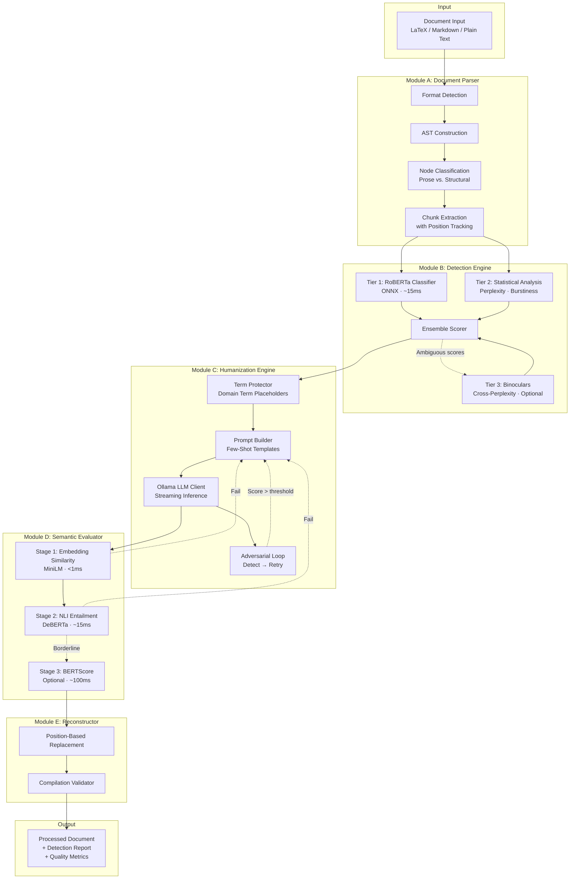

# Spectra: AI Content Detection & Humanization Engine

## System Overview

> **Codename:** Spectra (working title — TBD)
> **Version:** 0.1.0-design
> **Status:** Pre-development
> **Author:** Tom
> **Last Updated:** 2026-02-20

---

## 1. Executive Summary

Spectra is an offline-first, privacy-preserving system that detects AI-generated text, paraphrases content to bypass detection, and handles structured documents (LaTeX, Markdown) with full round-trip fidelity. It is the first open-source tool to combine all three capabilities with structural document awareness.

**What makes Spectra different:**

- **Document-aware processing.** LaTeX formulas, citations, cross-references, and structural macros are preserved verbatim while only prose nodes are detected/humanized. No existing tool — commercial or open-source — handles this.
- **Offline-first with Ollama.** All inference runs locally through Ollama (paraphrasing) and native ONNX/PyTorch (detection). No data leaves the machine. Cloud APIs are an optional enhancement, never a requirement.
- **Quantified semantic preservation.** Every paraphrase is scored for meaning fidelity through a three-stage evaluation pipeline. Users see concrete similarity scores, not just "humanized" output with no guarantees.
- **Configurable quality profiles.** Users choose their latency/quality trade-off: fast single-pass paraphrasing, balanced with semantic checks, or full adversarial refinement with iterative detection evasion.

**Target hardware:** Apple Silicon MacBook (M1 Pro, 16GB RAM) or equivalent x86-64 with 16GB+ RAM. No dedicated GPU required.

---

## 2. Core Capabilities

### 2.1 AI Content Detection

Accepts plain text, Markdown, or LaTeX input and produces a per-paragraph AI probability score (0.0–1.0) with an aggregate document score. Detection uses a tiered architecture:

- **Tier 1 — Fast Classifier (~15ms/paragraph).** ONNX-optimized RoBERTa-base fine-tuned on AI vs. human text. Handles 95% of cases.
- **Tier 2 — Statistical Analysis (~50ms/paragraph).** Perplexity estimation, burstiness measurement, vocabulary richness metrics. Provides explainability for Tier 1 scores.
- **Tier 3 — Deep Analysis (~2–5s/paragraph, optional).** Binoculars-style cross-perplexity using paired LLMs for high-confidence verdicts on ambiguous cases.

### 2.2 Content Humanization

Takes AI-flagged prose and rewrites it to reduce detection probability while preserving semantic meaning. Three modes:

- **Single-pass paraphrase.** Few-shot prompted LLM via Ollama. Fastest, suitable for light editing.
- **Evaluated paraphrase.** Single-pass with three-stage semantic validation. Rejects and retries paraphrases that drift too far from original meaning.
- **Adversarial refinement.** Iterative loop: paraphrase → detect → re-paraphrase with adjusted prompting until detection score drops below threshold. Highest evasion rate, highest latency.

### 2.3 Document Parsing & Reconstruction

Structured document support that no competitor offers:

- **LaTeX.** AST-based parsing via pylatexenc. Prose nodes are isolated from math environments, citations, cross-references, preamble, tables, figures, and custom macros. Position-based replacement preserves the original document byte-for-byte outside of modified prose regions.
- **Markdown.** Token-level parsing via markdown-it-py. Code blocks, inline math, front matter, HTML blocks, and link references are preserved. Round-trip rendering maintains formatting fidelity.
- **Plain text.** Sentence and paragraph segmentation with configurable boundary detection.

---

## 3. High-Level Architecture

---

## 4. Design Principles

### 4.1 Offline-First, Privacy by Default

All processing happens locally. The system never phones home, never sends text to external services, and never requires network access during operation. Ollama manages model downloads; once models are pulled, the system is fully air-gapped.

### 4.2 Ollama as the LLM Backend

All large language model inference for paraphrasing routes through the Ollama API (`localhost:11434`). This provides:

- **Model agnosticism.** Users swap models by changing a config string (`qwen2.5:3b`, `llama3.2:8b`, `phi3:3.8b`).
- **Quantization handled externally.** Ollama manages GGUF quantization variants. The system doesn't need to handle model formats.
- **Resource management delegated.** Ollama handles GPU offloading, memory mapping, and context window management.
- **Ecosystem leverage.** Any model Ollama supports becomes available to Spectra without code changes.

Detection models (RoBERTa, DeBERTa, MiniLM) run natively via ONNX Runtime because they require logit-level access that Ollama's API doesn't expose. These are small (<1GB each) and trivially fast on CPU.

### 4.3 Position-Based Replacement Over AST Reconstruction

The single most important architectural decision for document fidelity. Rather than:

1. Parse document into AST → Modify AST → Render AST back to source (lossy, introduces whitespace drift)

We do:

1. Parse document into AST → Extract prose with byte positions → Paraphrase prose → Replace bytes at exact positions in original document (lossless outside modified regions)

This guarantees that every byte of the original document that isn't in a paraphrased prose region remains untouched — including comments, custom whitespace, and formatting quirks.

### 4.4 Tiered Everything

Every module uses progressive tiers that trade latency for quality. Users and the system itself can choose the appropriate tier:

| Component    | Fast          | Balanced              | Quality            |
| ------------ | ------------- | --------------------- | ------------------ |
| Detection    | RoBERTa only  | RoBERTa + statistical | + Binoculars       |
| Humanization | Single-pass   | + Semantic eval       | + Adversarial loop |
| Evaluation   | Embedding sim | + NLI                 | + BERTScore        |
| Model size   | 3B            | 7B                    | 8B                 |

### 4.5 English-Only Scope

Initial release targets English content exclusively. This simplifies:

- Detection model selection (English-trained classifiers are most mature)
- Semantic evaluation (NLI and BERTScore calibrated for English)
- Prompt engineering (single language template set)
- Test corpus construction (arXiv English papers)

Multi-language support is a v2.0 concern that will require per-language detection models and evaluation calibration.

---

## 5. Key Constraints & Trade-offs

### 5.1 Ollama's API Limitations

Ollama exposes a chat/completion API but does **not** provide:

- Token-level log probabilities (needed for Binoculars, Fast-DetectGPT)
- Logit-level access during generation (needed for token-level adversarial guidance)
- Custom sampling hooks (needed for detector-guided decoding)

**Consequence:** The adversarial humanization loop operates at the **paragraph level** (generate full paraphrase → score → retry) rather than the token level (score each candidate token during generation). This requires more iterations to converge but is architecturally much simpler and works with any Ollama-compatible model.

**Mitigation for detection:** Binoculars and statistical detection methods run through native HuggingFace Transformers / ONNX, bypassing Ollama entirely. These models are small enough (~1.4GB total) that the dual-backend approach doesn't create memory pressure.

### 5.2 Memory Budget (16GB Target)

| Component                 | Memory        | Lifecycle     |
| ------------------------- | ------------- | ------------- |
| OS + System               | 3–4 GB        | Always        |
| RoBERTa classifier (ONNX) | ~500 MB       | Always loaded |
| MiniLM sentence encoder   | ~90 MB        | Always loaded |
| DeBERTa NLI model         | ~800 MB       | Always loaded |
| Ollama + 3B model         | ~2.5 GB       | On-demand     |
| Ollama + 8B model         | ~5.5 GB       | On-demand     |
| Processing headroom       | 1–3 GB        | Variable      |
| **Total (3B config)**     | **~8–9 GB**   |               |
| **Total (8B config)**     | **~11–12 GB** |               |

Binoculars (two 7B models, ~7GB) cannot coexist with an 8B paraphrasing model on 16GB. The system enforces sequential loading: run Binoculars for detection, unload, then load the paraphraser. On 32GB+ systems, both run simultaneously.

### 5.3 Latency Targets

| Operation                                          | Target (3B)  | Target (8B)    |
| -------------------------------------------------- | ------------ | -------------- |
| Parse LaTeX document (20 pages)                    | <500ms       | <500ms         |
| Detect per paragraph                               | 15–50ms      | 15–50ms        |
| Paraphrase per paragraph                           | 3–5s         | 8–15s          |
| Semantic evaluation per paragraph                  | 20–100ms     | 20–100ms       |
| Reconstruct document                               | <200ms       | <200ms         |
| **Full document (20 pages, ~60 prose paragraphs)** | **~5–8 min** | **~12–20 min** |

Adversarial refinement multiplies humanization time by 2–5× depending on convergence.

---

## 6. Ethical Framework & Responsible Disclosure

Spectra is a dual-use tool. It detects AI content (defensive) and humanizes it (offensive). The project embraces this duality with transparency:

### 6.1 Legitimate Use Cases

- **False positive defense.** AI detectors frequently misclassify non-native English speakers, neurodivergent writers, and technical authors. Spectra helps users understand and address these false flags.
- **Writing quality improvement.** Transforms robotic AI drafts into natural-sounding prose while preserving technical accuracy.
- **Research tool.** Enables study of detection robustness, adversarial text generation, and the fundamental limits of AI text detection.

### 6.2 Responsible Development Commitments

- **Transparency.** All detection accuracy and evasion rates are published with methodology.
- **No watermark stripping.** The system does not specifically target or remove AI watermarks (relevant for EU AI Act compliance, Article 50, effective August 2026).
- **Human-in-the-loop.** All outputs require human review. The system provides scores and suggestions, not autonomous publishing.
- **Open benchmarking.** Detection and humanization results are reproducible via included benchmark suites.

### 6.3 Licensing

The project is released under MIT license. Model dependencies carry their own licenses:

| Dependency    | License          | Commercial Use                               |
| ------------- | ---------------- | -------------------------------------------- |
| Phi-3 / Phi-4 | MIT              | ✅ Unrestricted                              |
| Mistral 7B    | Apache 2.0       | ✅ Unrestricted                              |
| Qwen2.5       | Apache 2.0       | ✅ Unrestricted                              |
| Llama 3.x     | Meta Community   | ✅ With attribution, <700M MAU               |
| Gemma 2       | Google Use Terms | ⚠️ Google reserves remote restriction rights |
| RoBERTa       | MIT              | ✅ Unrestricted                              |
| DeBERTa       | MIT              | ✅ Unrestricted                              |

**Recommended default models for lowest licensing risk:** Phi-3-mini (3.8B, MIT) and Qwen2.5-7B (Apache 2.0).

---

## 7. Target Audience

- **Researchers** studying AI text detection and adversarial robustness
- **Academic writers** checking their work against AI detectors before submission
- **Non-native English speakers** verifying and improving flagged content
- **Developers** building AI content analysis into their own tools
- **Organizations** evaluating AI detection tool reliability

---

## 8. What Spectra Is NOT

- **Not a cheating tool.** It doesn't write essays or generate academic content. It processes existing text.
- **Not a plagiarism tool.** It doesn't copy or recombine existing works. It paraphrases in the linguistic sense.
- **Not a guaranteed bypass.** Detection evasion rates vary by detector, content type, and model. Published benchmarks reflect specific test conditions.
- **Not a production service.** It's a development tool and research platform, not a hosted SaaS product.
